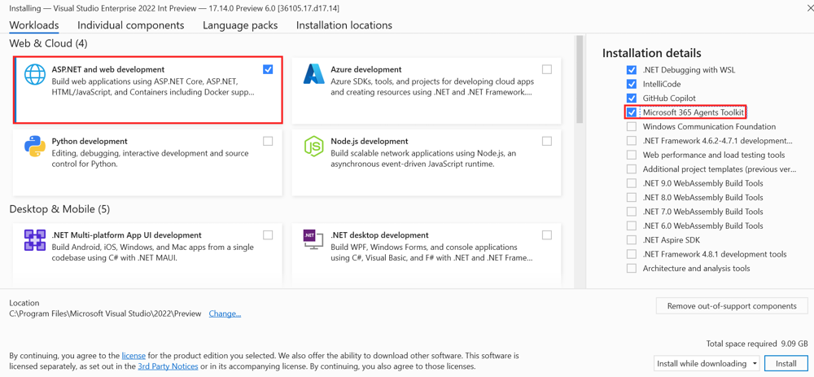

# Lab BMA0 - Prerequisites

In this lab you will set up your development environment to build, test, and deploy the custom engine agent you will develop throughout the path.

In this lab you will learn how to:

- Setup your Microsoft 365 environment
- Install and configure Visual Studio 2022 with Microsoft 365 Agents Toolkit
- Prepare your Azure environment to create required resources

!!! pied-piper "Disclaimer"
    These samples and labs are intended for instructive and demonstration purposes and are not intended for use in production. Do not put them into production without upgrading them to production quality.

!!! note "Note"
    To install and run your own custom engine agent, you'll need a Microsoft 365 tenant where you have administrator permission. You won't need Microsoft 365 Copilot License to test your custom engine agent.

## Exercise 1 : Setup Microsoft Teams

### Step 1: Enable Teams custom application uploads

By default, end users can't upload applications directly; instead a Teams administrator needs to upload them into the enterprise app catalog. In this step you will ensure your tenant is set up for direct uploads by M365 Agents Toolkit.

1️⃣ Navigate to [https://admin.microsoft.com/](https://admin.microsoft.com/){target=_blank}, which is the Microsoft 365 Admin Center.

2️⃣ In the left panel of the admin center, select **Show all** to open up the entire navigation. When the panel opens, select Teams to open the Microsoft Teams admin center.

3️⃣ In the left of the Microsoft Teams admin center, open the Teams apps accordion. Select **Setup Policies**, you will see a list of App setup policies. Then, select the **Global (Org-wide default) policy**.

4️⃣ Ensure the first switch, **Upload custom apps** is turned **On**.

5️⃣ Be sure to scroll down and select the **Save** button to persist your change.

> The change can take up to 24 hours to take effect, but usually it's much faster.

<cc-end-step lab="bma0" exercise="1" step="1" />

## Exercise 2: Setup M365 Agents Toolkit

You can complete these labs on a Windows machine and you do need the ability to install the prerequisites. If you are not permitted to install applications on your computer, you'll need to find another machine (or virtual machine) to use throughout the workshop.

### Step 1: Install Agents Toolkit for Visual Studio

1. You can download Visual Studio 2022 here: [Visual Studio 2022](https://code.visualstudio.com/download){target=_blank}.
1. Select **Install**. If you've already installed Visual Studio, select **Modify**.
1. Visual Studio installer shows all workloads.
    
1. From the installation screen, perform the following steps:
    1. Select **Workloads > ASP.NET and web development**.
    1. On the right pane, go to **Installation details > Optional** and then select **Microsoft 365 Agents toolkit**.
    1. Select **Install**. Visual Studio is installed and a pop-up appears.
1. Select **Launch**.

<cc-end-step lab="bma0" exercise="2" step="1" />

## Exercise 3: Get an Azure subscription

To complete the exercises in Path B, you'll need an Azure subscription to create resources on Azure. If you don't have an Azure subscription yet, you can activate an [Azure free account](https://azure.microsoft.com/en-us/pricing/offers/ms-azr-0044p){target=_blank} that offers $200 in credits which can be used within the first 30 days on most Azure services.

### Step 1: Create an Azure free account

Follow the steps to activate an Azure free account:

1️⃣ Navigate to [Azure free account](https://azure.microsoft.com/en-us/pricing/offers/ms-azr-0044p){target=_blank} page and select **Activate**.

2️⃣ Login with an account of your choice, it's recommended to use the Microsoft 365 tenant account you would like to use in the exercises.

3️⃣ Check the boxes for Privacy Statement, then select **Next**.

4️⃣ Provide a mobile phone number for identity verification step.

5️⃣ Provide payment details for a temporary authorization. You won’t be charged unless you move to pay-as-you-go pricing. Then, select **Sign up**.

!!! tip "Tip: Managing Azure resources after 30 days"
    Azure free account will be available only for 30 days. Make sure you don't have any services running in your free subscription at the end of 30 days. If you want to continue using Azure services at the end of 30 days, you must upgrade to a pay-as-you-go subscription by removing the spending limit. This allows continued use of the Azure free account and select free services for the term.

<cc-end-step lab="bma0" exercise="3" step="1" />

---8<--- "b-congratulations.md"

You have completed Lab BMA0 - Setup!
You are now ready to proceed to lab BMA1 - Prepare your agent in Azure AI Foundry. Select Next.

<cc-next />

