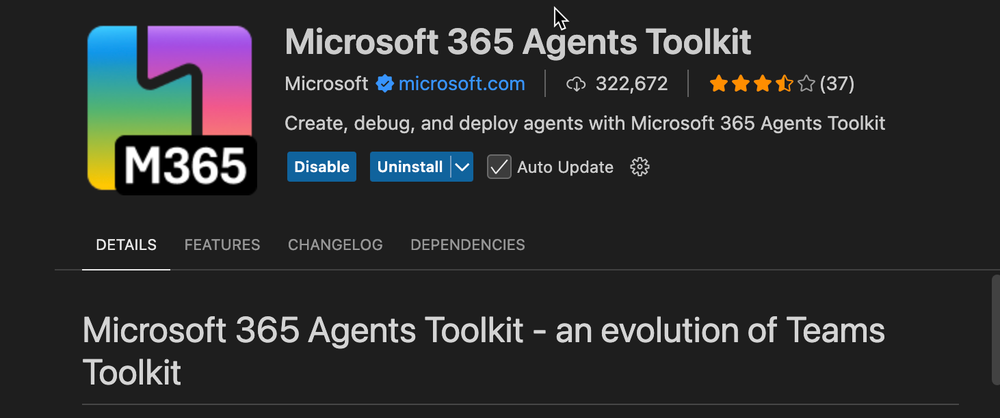

# Lab E0 - Setup

---8<--- "e-labs-prelude.md"

    <iframe src="//www.youtube.com/embed/VDhRFMH3Qbs" frameborder="0" allowfullscreen></iframe>

In this lab, you will set up the development environment to build, test, and deploy the Copilot agents, that will help you achieve tailor made AI assitance using Microsoft 365 Copilot. 

!!! note "Set up your development environment for Microsoft 365 Copilot"
    This lab currently assumes you already have a tenant to setup. You can reference off to the
    [page here](https://learn.microsoft.com/en-us/microsoft-365-copilot/extensibility/prerequisites){target=_blank} that explains the current way you can get a tenant.

In this lab you will learn:

- How to configure your Microsoft 365 tenant's Teams upload policy for lab use
- How to install and configure Microsoft 365 Agents Toolkit for Visual Studio Code

!!! pied-piper "Disclaimer"
    These samples and labs are intended for instructive and demonstration purposes and are not intended for use in production. Do not put them into production without upgrading them to production quality.

## Exercise 1 : Configure Teams upload policy

### Step 1: Enable Teams custom application uploads

By default, end users can't upload applications directly; instead a Teams Administrator needs to upload them into the enterprise app catalog. In this step you will ensure your tenant is set up for direct uploads by Agents Toolkit.

1️⃣ Navigate to [https://admin.microsoft.com/](https://admin.microsoft.com/){target=_blank}, which is the Microsoft 365 Admin Center.

2️⃣ In the left pane of the admin center, select **Show all** to open up the entire navigation. When the pane opens, select Teams to open the Microsoft Teams admin center.

3️⃣ In the left pane of the Microsoft Teams admin center, open the Teams apps accordion. Select **Setup Policies**, you will see a list of App setup policies. Then, select the **Global (Org-wide default) policy**.

4️⃣ Ensure the first switch, **Upload custom apps** is turned **On**.

5️⃣ Be sure to scroll down and select the **Save** button to persist your change.

> The change can take up to 24 hours to take effect, but usually it's much faster.

<cc-end-step lab="e0" exercise="1" step="1" />

## Exercise 2: Install Agents Toolkit and prerequisites

You can complete these labs on a Windows, Mac, or Linux machine, but you do need the ability to install the prerequisites. If you are not permitted to install applications on your computer, you'll need to find another machine (or virtual machine) to use throughout the workshop.

### Step 1: Install Visual Studio Code

It should be no surprise that **Agents Toolkit for Visual Studio Code** requires Visual Studio Code! You can download it here: [Visual Studio Code](https://code.visualstudio.com/download){target=_blank}.

<cc-end-step lab="e0" exercise="2" step="1" />

### Step 2: Install Node.js

Node.js is a program that allows you to run JavaScript on your computer; it uses the open source "V8" engine, which is used in popular web browsers such as Microsoft Edge and Google Chrome. You will need Node.js to run the web server code used throughout this workshop.

Browse to [https://nodejs.org/en/download/](https://nodejs.org/en/download/){target=_blank} and install version 18 or 16 for your operating system. This lab has been tested using Node.js version 18.16.0. If you already have another version of Node.js installed, you may want to set up the [Node Version Manager](https://github.com/nvm-sh/nvm){target=_blank} (or [this variation](https://github.com/coreybutler/nvm-windows){target=_blank} for Microsoft Windows), which allows you to easily switch Node.js versions on the same computer.

<cc-end-step lab="e0" exercise="2" step="2" />

### Step 3: Install Agents Toolkit

These labs are based on **Microsoft 365 Agents Toolkit** version 6.0.

!!! tip "What is Agents Toolkit?"
    Microsoft 365 Agents Toolkit is an evolution of Microsoft Teams Toolkit, is designed to help you develop agents and apps for Microsoft 365 Copilot, Microsoft Teams, and Microsoft 365.

Follow the steps as shown in the screen shot below.

1️⃣ Open Visual Studio Code and click on the Extensions toolbar button

2️⃣ Search for "Microsoft 365 Agents" and locate Agents Toolkit

3️⃣ Click **Install**

!!! note "If you have Agents Toolkit installed but hidden"
    If you previously installed Agents Toolkit, and then hid it on the Visual Studio sidebar, you might wonder why you can't see it. Right-click on the left sidebar and check off Agents Toolkit to bring it back into view.

<cc-end-step lab="e0" exercise="2" step="3" />

---8<--- "e-congratulations.md"

Now you are all set to create your first extensibility feature for Microsoft 365 Copilot. Proceed to create a Declarative Agent in the next lab. 

<cc-next />

