# Lab MCS3 - Defining Tools

In this lab, you'll learn how to create Tools in Microsoft Copilot Studio. Tools are another core building block of an agent. With tools you can extend the capabilities of your agent by adding support for external Power Platform connectors (native or custom), external REST APIs, Power Automate flows, MCP (Model Context Protocol) servers, etc.

<div class="lab-intro-video">
    <div style="flex: 1; min-width: 0;">
        <iframe  src="//www.youtube.com/embed/ZVHkBiH6RxQ" frameborder="0" allowfullscreen style="width: 100%; aspect-ratio: 16/9;">          
        </iframe>
          <div>Get a quick overview of the lab in this video.</div>
    </div>
    <div style="flex: 1; min-width: 0;">
   ---8<--- "mcs-labs-prelude.md"
    </div>
</div>

!!! note
    This lab builds on the previous one, [Lab MCS2](../02-topics){target=_blank}. You should be able to continue working on the same agent, improving its functionalities with new capabilities.

Tools can be created with a graphical designer. Once you have created a new Tool, you can also edit its definition with a low level code editor, in case you need to apply detailed fine tuning.

In this lab you will learn:

- How to create a tool to invoke a Power Platform connector
- How to create a tool to invoke a Power Automate flow
- How to invoke tools from topics

## Exercise 1 : Creating tools in Microsoft Copilot Studio

In this exercise you are going to enhance the agent that you created in [Lab MCS2](../02-topics){target=_blank} to use Excel Online to retrieve a hypotethical list of candidates from an Excel spreadsheet stored in a SharePoint Online document library. Then you will add a tool to consume a Power Automate flow that can add new candidates to the same spreadsheet.

### Step 1: Consuming a Power Platform connector

To create a new tool, in the upper side of the screen select the 1️⃣ **Tools** tab, then select 2️⃣ **+ Add a tool** to start creating a new tool.

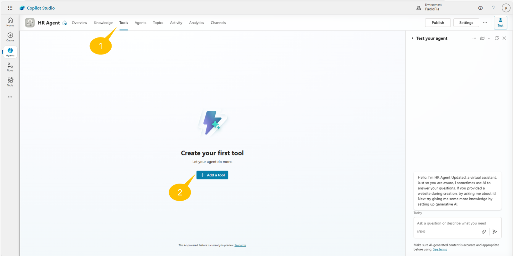

A dialog window pops up allowing you to choose what kind of tool to create. By default, there are some **Featured** tools like those that allow you to interact with Excel Online content or other common services. 

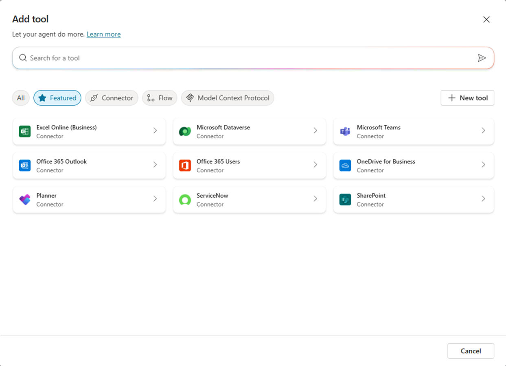

You can also create a new tool from scratch, selecting the **+ New tool** command and choosing between the following options:

- Prompt: allows consuming an AI tool built using a prompt written in natural language.
- Agent flow: allows consuming a Power Automate flow (see [Step 2](#step-2-consuming-a-power-automate-flow)).
- Custom connector: allows consuming a Power Platform custom connector.
- REST API: allows consuming an external REST API. You can find additional details [here](https://learn.microsoft.com/en-us/microsoft-copilot-studio/agent-extend-action-rest-api){target=_blank}.
- Model Context Protocol: to consume tools from an external Model Context Protocol (MCP) server.

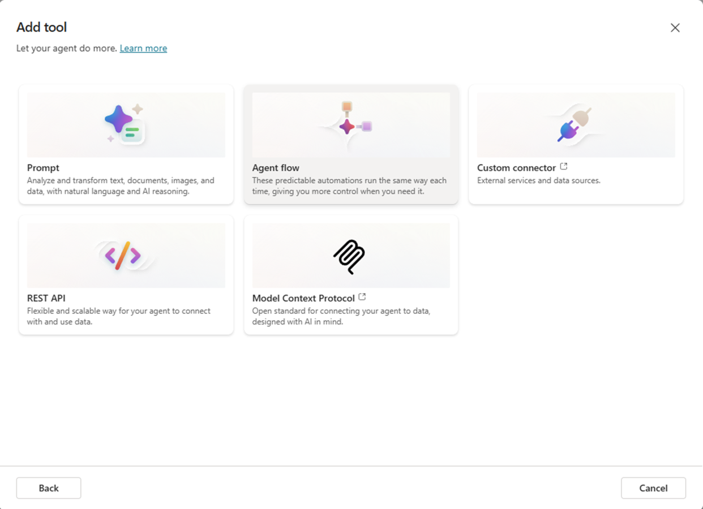

If you don't find the option you are looking for in the list of featured items, simply switch to the **All** group and search by text what you are looking for.

To complete the current step, choose the featured tool **Excel Online (Business)** and then select **List rows present in a table**. First of all, you will need to connect to the external connector simply selecting the **Connection** and then **Create new connection** and proceeding with the process.

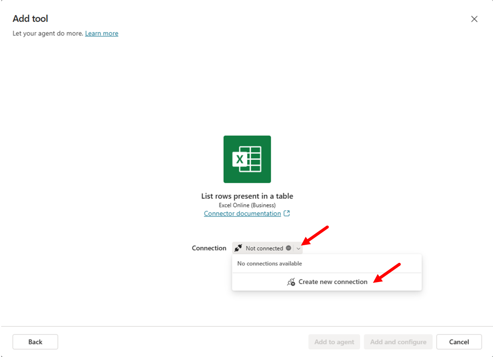

You will need to login with your account and to allow access to Excel Online (Business). Once the connection is configured, you will see a dialog with commands to **Add to agent** or **Add and configure** the tool.

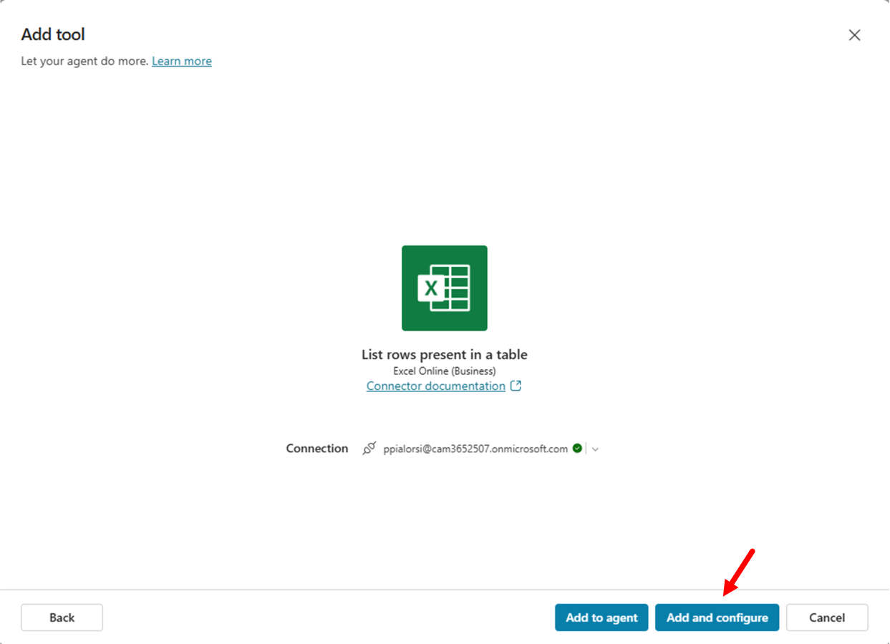

Next, you get a page to configure the actual tool. You need to provide:

- Name: simply a descriptive name for the tools.
- Description: a description in natural language that will be used by generative orchestration to determine when to use your tool. 
- Inputs: to define the input arguments for the tool, if any.
- Completion: defines how the tool handles the request and response to the user.

Before configuring the tool, you need to prepare the Excel spreadsheet with the list of candidates.
Download a sample Excel file by selecting this [link](https://github.com/microsoft/copilot-camp/blob/main/src/make/copilot-studio/Candidates/Sample-list-of-candidates.xlsx?raw=true){target=_blank}.

Upload the file to the **Documents** library of a SharePoint Teams site in the same tenant where you are making your agent with Copilot Studio. The document was generated by Microsoft 365 Copilot for the sake of having a hypothetical list of candidates.

- Copy the absolute url of the site. For example: `https://xyz.sharepoint.com/sites/contoso/`.
- Copy the name of the document library. For example : `Shared documents`
- Copy also the name of the file. For example: `Sample-list-of-candidates.xlsx`

Now go back to Microsoft Copilot Studio and finalize the tool configuration.

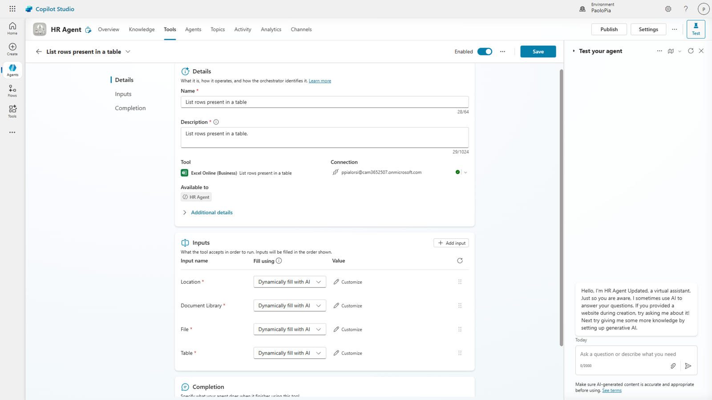

Use the following settings:

- Name: List HR candidates
- Description: List candidates for an HR role

Then select the **Inputs** tab and start configuring the input arguments.
By default, all the mandatory input arguments have been configured so that their value will be `Dynamically fill with AI` as you can notice in the **Fill as** property of each input argument.

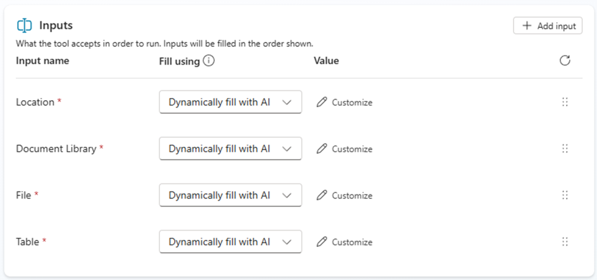

Select the **Fill using** setting for each of the input arguments and switch to `Custom value` in order to provide static values for all of the input arguments.

Use the following static values:

- Location: use the URL of the SharePoint Online site collection where you stored the Excel spreadsheet. For example: `https://xyz.sharepoint.com/sites/contoso/`.
- Document Library: use the name of the document library where you stored the Excel spreadsheet. For example: `Shared Documents`.
- File: provide the name of the Excel file. For example: `Sample-list-of-candidates.xlsx`.
- Table: `Candidates_Table`

You can browse the sites, libraries, files, and tables through the native UI of Microsoft Copilot Studio.

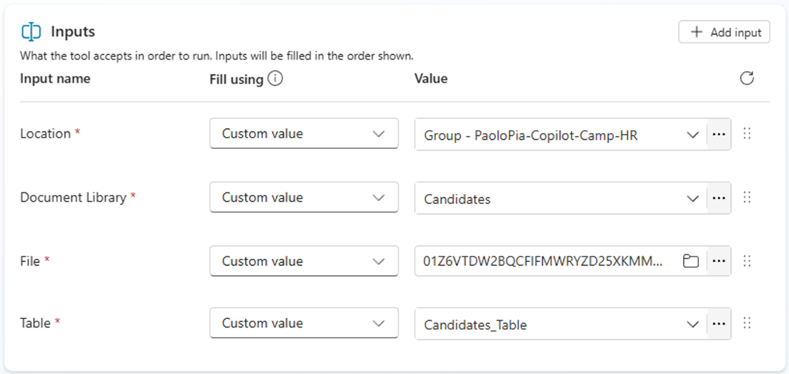

Now select the **Save** button in the upper right corner of the screen to save the updated tool.

<cc-end-step lab="mcs3" exercise="1" step="1" />

### Step 2: Testing the new tool

You are now ready to publish the updated agent and to play with it in the integrated test panel or in Microsoft Teams.

Since in [Lab MCS2](../02-topics){target=_blank} you enabled generative orchestration, it is really easy to invoke the just created tool simply providing to the agent a prompt like the following one:

```txt
Show me the list of candidates for an HR role
```

Something really nice of Copilot Studio when using the generative orchestration and invoking prompts within the test panel is that by default you get an Activity map to investigate how the orchestrator works. In the following screenshot you can see the Activity map for the prompt suggested before. The orchestrator indentifies the user's intent, based on the prompt, and triggers the tool that you created in Step 1. You can also validate the manually defined input arguments.

Since the Power Platform connector requires a valid connection in place, the agent prompts the user to **Connect** before being able to consume the external data source.

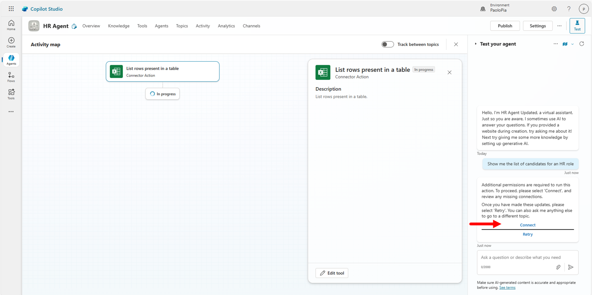

Select the **Connect** button and proceed to activate the connection. You will see, in a new browser tab, the list of active connections for your current session, including the connection to `Excel Online (Business)`. Select the **Connect** link to activate the connection through a dedicated dialog with title **Create or pick a connection**. Once the connection is ready and connected, go back to the agent and select the **Retry** command to execute the tool against the target connection. In the test panel you get the list of candidates retrieved from the Excel spreadsheet.


Well done, so far! You can now move to the next step.

<cc-end-step lab="mcs3" exercise="1" step="2" />

### Step 3: Consuming an Agent flow

In this step you are going to create a tool to consume a Power Automate flow. Let's say that you want to add new candidates to the Excel spreadsheet, based on the user's input. You can simply create a tool that invokes an external Power Automate flow, which adds a new row to the table in the Excel spreadsheet.

To create such a tool, in the upper side of the screen select the **Tools** tab, then select **+ Add a tool** to start creating a new tool. This time, select the **+ New tool** button and then **Agent flow**. A new page will be opened, navigating to a the **Agent flows** designer and rendering a new flow.

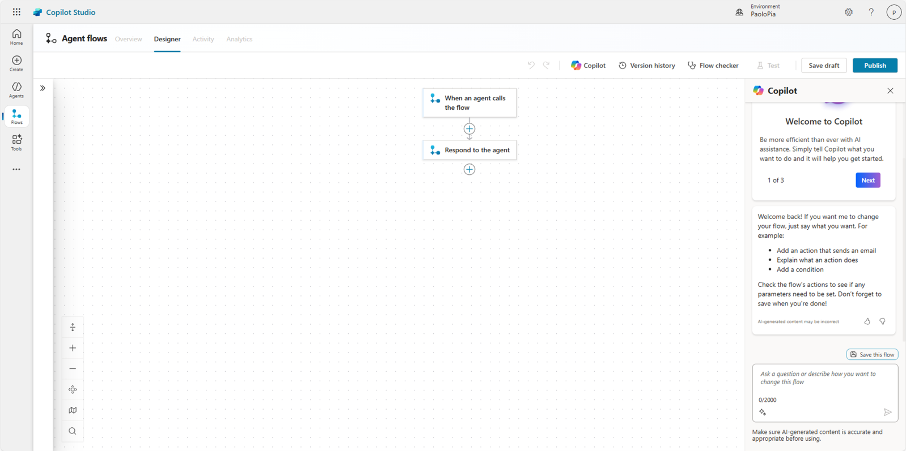

The flow has an initial triggering action with name `When an agent calls the flow` and a final action with name `Respond to the agent`. The overall idea is that you can define your own business process between these two flow actions and the Copilot Studio tool will trigger the business process for you, eventually providing one or more input arguments and providing a response back to the agent. Select the first action to edit its properties. You can configure a set of input arguments for the flow, so that Copilot Studio will be able to feed the flow through the action upon activation.

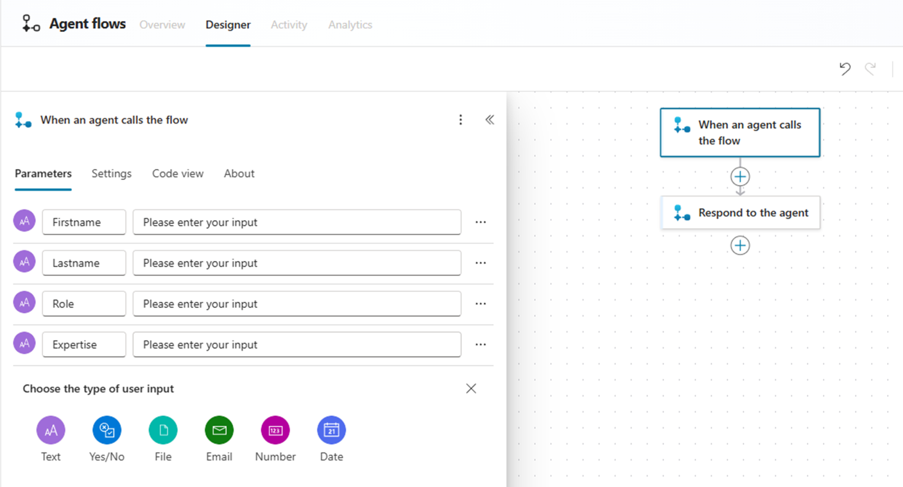

For the sake of being able to add new candidates, configure four input parameters with the following settings:

- Firstname: text
- Lastname: text
- Role: text
- Expertise: text

Now add, between the two pre-created actions, a new action of type **Add a row into a table** from the **Excel Online (Business)** connector.
Configure the new flow action in order to target the Excel spreadsheet with the list of candidates. Map the column fields of the row to the actual input parameters defined in the triggering action invoked by Copilot. Rename the action into `Add new candidate row`. In the following screenshot you can see how the action is configured.


Now select the final action `Respond to Copilot`, edit its properties and add an output parameter of type `Text` with name `Result`. Set the value of the output paremeter to a formula that renders a message like the one illustrated in the following screenshot.


Now **Save draft**, update the name of the flow in the **Overview** tab, editing the **Details** of the agent flow. You can use a name like for example `Insert new candidate for HR`. Publish the flow and go back to the agent where you were editing the tool. Open again the dialog window to add a new tool, select **Flow** as the filter and you will be able to see the new Agent flow that you just created. If not, try searching for its name.

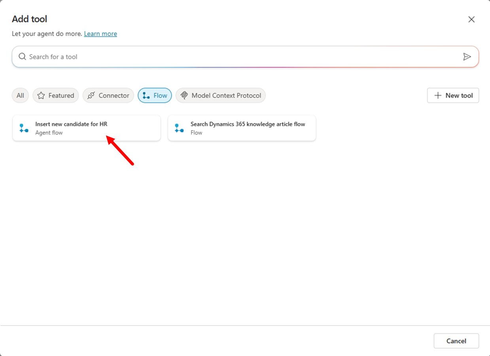

Select the new tool, in the next dialog window select **Add and configure** to configure its settings as like as you did in Step 1, and play with it. For example, use the following settings:

- Name: Insert new candidate for HR
- Description: Insert new candidate into the Excel spreadsheet for HR

Select the **Save** button and the new tool based on the Agent flow will be ready.
Now let's trigger the tool with a prompt like the following one:

```txt
Insert a new candidate into the Excel spreadsheet of HR. The candidate firstname is John, 
the lastname is White, the role is "HR Administrator", and the expertise is "Compliance".
```

As like as it was with the previous Step, the first time you use the tool you need to connect to Excel Online in order to consume the connector. If that is the case, select the **Connect** button and once you will be connected, select the **Retry** button to execute the actual tool.


After the execution of the tool, you will see the agent replying back to you with the response message that you defined in the Power Automate flow. Moreover, the new candidate will be added to the table in the Excel spreadsheet.

<cc-end-step lab="mcs3" exercise="1" step="3" />

## Exercise 2 : Invoking tools from within a topic

In this exercise you are going to consume the tool that you just defined from within a topic.

### Step 1: Invoking a tool from a topic

First of all, create a new tool from blank, give it name `Add a new candidate to Excel`, and follow the same steps defined in [Exercise 4 of Lab MCS2](../02-topics#exercise-4--using-adaptive-cards){target=_blank}.

The triggering description can be something like the following:

```txt
This topic helps users to insert new candidates in the Excel spreadsheet of HR.
Triggering sentences can be: add a new a new row to the persistence storage.
```

For the sake of simplicy, we are not going to cover all of the steps here. However, you can simply refer to Lab MCS2 for additional details. 

Here follows the JSON of the adaptive card that you can use to collect the input arguments about the candidate through an action of type **Ask with adaptive card**.

```json
{
    "type": "AdaptiveCard",
    "body": [
        {
            "type": "TextBlock",
            "size": "Medium",
            "weight": "Bolder",
            "text": "New HR Candidate Information"
        },
        {
            "type": "Input.Text",
            "id": "firstname",
            "placeholder": "First Name"
        },
        {
            "type": "Input.Text",
            "id": "lastname",
            "placeholder": "Last Name"
        },
        {
            "type": "Input.Text",
            "id": "current_role",
            "placeholder": "Current Role"
        },
        {
            "type": "Input.Text",
            "id": "expertise",
            "placeholder": "Expertise"
        }
    ],
    "actions": [
        {
            "type": "Action.Submit",
            "title": "Submit"
        }
    ],
    "$schema": "http://adaptivecards.io/schemas/adaptive-card.json",
    "version": "1.5"
}
```

Then add a new tool from the group **Add an tool**, select the tab **Tool**, and select the tool that you just created in [Exercise 1 - Step 3](#step-3-consuming-a-power-automate-flow).

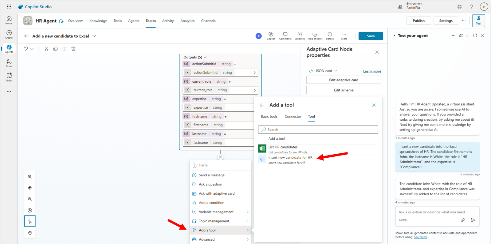

Now you need to map the input arguments of the tool with the variables collected by the user via the adaptive card.

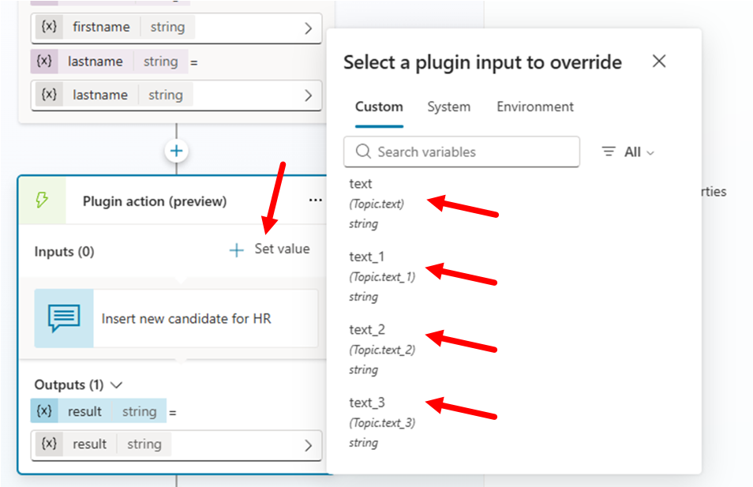

Select the **+ Set value** for each and every input argument and select the corresponding arguments as follows:

- text: represents the first name
- text_1: represents the last name
- text_2: represents the current role
- text_3: represents the expertise

Then, using data binding in Copilot Studio, configure every input argument to the corresponding topic level variables, collected by the user through the **Ask with adaptive card** action.
At the end, the tool action will look like in the following image.

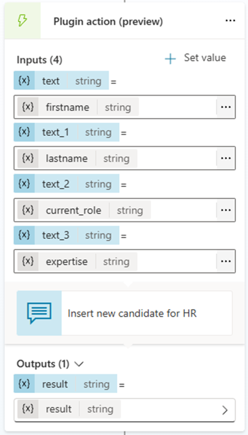

Add an action to **End current topic** and save it.

Now, disable any other topic that you created in Lab MCS2 and invoke the new topic to insert a new candidate row into the Excel spreadsheet using the following prompt:

```txt
Add a new a new row to the persistence storage
```

Fill the adaptive card and submit the request. The tool will be triggered via the topic and you will have yet another new candidate in the Excel spreadsheet.


<cc-end-step lab="mcs3" exercise="2" step="1" />

---8<--- "mcs-congratulations.md"

Now your agent supports tools. In the next lab you will learn how to use Copilot Studio to create Declarative Agents for Microsoft 365 Copilot Chat.

<a href="../04-extending-m365-copilot">Start here</a> with Lab MCS4, to learn how to use Copilot Studio to create Declarative Agents for Microsoft 365 Copilot Chat.
<cc-next />


