# Lab MCS6 - Consuming an MCP server

In this lab, you are going to understand how to extend an agent made with Microsoft Copilot Studio using an MCP (Model Context Protocol) server. Specifically, you are going to consume an existing MCP server that provides tools for managing a hypothetical list of candidates for a job role. The MCP server will offer functionalities to:

- List all candidates 
- Search for candidates by criteria
- Add new candidates 
- Update existing candidate information
- Remove candidates 

<div class="lab-intro-video">
    <div style="flex: 1; min-width: 0;">
        <iframe  src="//www.youtube.com/embed/Y8KpHmmMqzc" frameborder="0" allowfullscreen style="width: 100%; aspect-ratio: 16/9;">          
        </iframe>
          <div>Get a quick overview of the lab in this video.</div>
    </div>
    <div style="flex: 1; min-width: 0;">
   ---8<--- "mcs-labs-prelude.md"
    </div>
</div>

!!! tip "Learn about MCP"
    This lab introduces MCP concepts and shows how to integrate them with Copilot Studio. MCP is a new protocol that allows AI assistants to securely connect to external data sources and tools. You can learn more about MCP reading the content available in the [Model Context Protocol (MCP) for beginners](https://github.com/microsoft/mcp-for-beginners){target=_blank} training class.

In this lab you will learn:

- How to configure and connect to an existing MCP server
- How to consume MCP tools and resources from an external server
- How to integrate MCP servers with Copilot Studio agents

## Exercise 1 : Setting up the MCP Server

In this exercise you are going to setup a pre-built MCP server that provides HR candidates management functionality. The server is based on Microsoft .NET and relies on the MCP SDK for C#. The server provides tools to manage a hypothetical list of job candidates. In this exercise you are going to download and configure the server, so that you can run it locally.

### Step 1: Understanding the MCP Server and prerequisites

The HR MCP server that you will be consuming in this lab provides the following tools:

- **list_candidates**: Provides the whole list of candidates
- **search_candidates**: Searches for candidates by name, email, skills, or current role
- **add_candidate**: Adds a new candidate to the list
- **update_candidate**: Updates an existing candidate by email
- **remove_candidate**: Removes a candidate by email

The server manages candidates information including:

- Personal details (firstname, lastname, full name, email)
- Professional information (spoken languages, skills, current role)

Before starting, make sure you have:

- [.NET 8.0 SDK](https://dotnet.microsoft.com/download/dotnet/8.0){target=_blank}
- [Visual Studio Code](https://code.visualstudio.com/){target=_blank}
- [Node.js v.22 or higher](https://nodejs.org/en){target=_blank}
- [MCP Inspector](https://github.com/modelcontextprotocol/inspector){target=_blank}
- [Dev tunnel](https://learn.microsoft.com/en-us/azure/developer/dev-tunnels/get-started){target=_blank}

<cc-end-step lab="mcs6" exercise="1" step="1" />

### Step 2: Downloading and running the MCP Server

For this lab, you will use a pre-built HR MCP server. Download the server files [from here](https://download-directory.github.io/?url=https://github.com/microsoft/copilot-camp/tree/main/src/make/copilot-studio/path-m-lab-mcs6-mcp/hr-mcp-server&filename=hr-mcp-server){target=_blank}.

Extract the files from the zip and open the target folder with Visual Studio Code. The server is already implemented and ready to run.

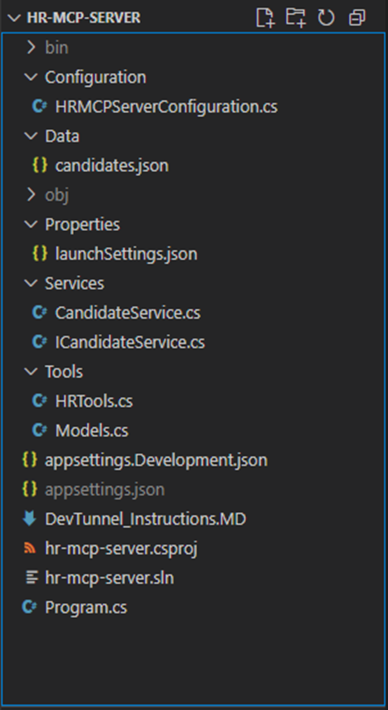

The main elements of the project outline are:

- `Configuration`: folder with the `HRMCPServerConfiguration.cs` file defining the configuration settings for the MCP server.
- `Data`: folder with the `candidates.json` file providing the list of candidates.
- `Services`: folder with the `ICandidateService.cs` interface and the actual `CandidateService.cs` implementation of a service to load and manage the list of candidates.
- `Tools`: folder with the `HRTools.cs` file defining the MCP tools and the `Models.cs` file defining the data models used by the tools.
- `DevTunnel_Instructions.MD`: instructions about how to expose the MCP server via a dev tunnel.
- `Progam.cs`: the main entry point of the project, where the MCP server gets initialized.

Open a new terminal window from within Visual Studio Code or simply start a new terminal window and move to the root folder of the MCP server project that you just extracted. Then install dependencies, build, and start the .NET project by invoking the following command:

```console
dotnet run
```

Check that the MCP server is up and running. You should be able to consume the server via browser at the URL [http://localhost:47002/](http://localhost:47002/){target=_blank}. You will see an error inside a JSON message, that's ok. It means that you are reaching the MCP server.

!!! info
    The pre-built HR MCP Server provided with this lab is not a production-ready solution. It operates using an in-memory list of candidates and does not retain data across multiple conversation sessions. It was developed specifically for the purpose of this lab, to offer a simple and accessible solution. If you are a professional developer, you may consider it a starting point for understanding the fundamentals of building an MCP server exposed via HTTP. If you like you can improve the server relying on a container app and adding persistence storage. For example, [here](https://github.com/fabianwilliams/hr-mcp-server){target=_blank} you can find a more advanced version of the server, implemented by [Fabian Williams (Microsoft)](https://github.com/fabianwilliams/){target=_blank}.

<cc-end-step lab="mcs6" exercise="1" step="2" />

### Step 3: Configure the dev tunnel

Now, you need to expose the MCP server with a public URL. Since you are running the server locally on your development machine, you need to rely on a reverse proxy tool to expose your `localhost` via a public URL. For the sake of simplicity, you can use the dev tunnel tool provided by Microsoft, following these steps:

- Install dev tunnel on your environment following [these instructions](https://learn.microsoft.com/en-us/azure/developer/dev-tunnels/get-started){target=_blank}
- Login with dev tunnel, executing the following command:

```console
devtunnel user login
```

- Host your dev tunnel, executing the following commands:

!!! important
    Replace the `hr-mcp` name suggested below with whatever name you like, in order to have a unique name for your dev tunnel. For example, if your name is Rose you can use `hr-mcp-rose` as the name for your tunnel. In case you will get an error like `Request not permitted. Unauthorized tunnel creation access ...` it means that someone else is already using that name. To solve the issue, simply provide a different name.

```console
devtunnel create hr-mcp -a --host-header unchanged
devtunnel port create hr-mcp -p 47002
devtunnel host hr-mcp
```

The command line will display the connection information, such as:


Copy the "Connect via browser" URL and save it in a safe place. Open a browser and navigate to the just copied URL. You might need to confirm that you want to consume the MCP server via the dev tunnel through a confirmation page like the following one.

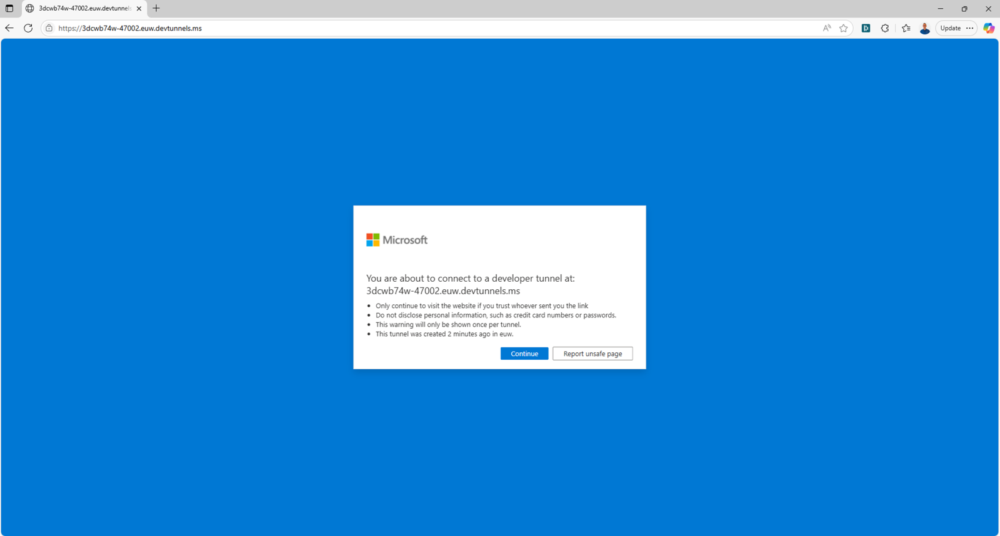

Be sure to leave both the dev tunnel command and the MCP server running as you do the exercises in this lab. If you need to restart it, just repeat the last command `devtunnel host hr-mcp`.

<cc-end-step lab="mcs6" exercise="1" step="3" />

### Step 4: Testing the MCP server

You are now ready to test the MCP server on your local environment. For the sake of simplicity, you can use the [MCP Inspector](https://github.com/modelcontextprotocol/inspector){target=_blank}. Start a terminal window and run the following command:

```console
npx @modelcontextprotocol/inspector
```

The Node.js engine will download and run the MCP Inspector, in the terminal window you should see an output like the following one.


The browser will start automatically and you will see the following interface.


Configure the MCP Inspector with the following settings:

- 1️⃣ **Transport type**: Streamable HTTP
- 2️⃣ **URL**: the URL that you saved from the "Connect via browser" of the dev tunnel

Then select the 3️⃣ **Connect** button to start consuming the MCP server. The connection should be successful, and you should be able to have a green bullet and the message **Connected** just below the connection handling commands.
Now, in the Tools section of the screen, select the 1️⃣ **List Tools** command to retrieve the list of tools exposed by the MCP server.
Then, select the 2️⃣ **list_candidates** tool, and then select 3️⃣ **Run tool** to invoke the selected tool.


In case of successful response, you will see a **Success** message in green and the output of the tool invocation.
In the **History** section you can always review all the invocations sent to the MCP server.

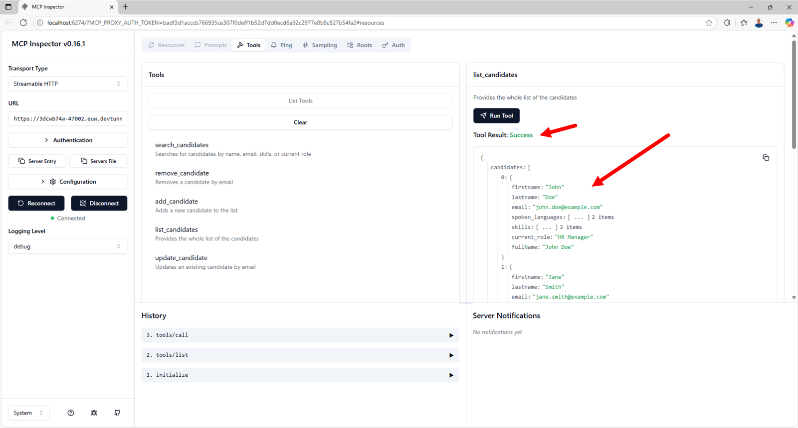

You are now ready to consume the MCP server from an agent in Microsoft Copilot Studio.

<cc-end-step lab="mcs6" exercise="1" step="4" />

## Exercise 2 : Creating a New Agent in Copilot Studio

In this exercise you are going to create a new agent in Microsoft Copilot Studio that will consume the MCP server you configured in Exercise 1.

### Step 1: Creating the new agent

Open a browser and, using the work account of your target Microsoft 365 tenant, go to [https://copilotstudio.microsoft.com](https://copilotstudio.microsoft.com){target=_blank} to start using Microsoft Copilot Studio.

Select the `Copilot Dev Camp` environment that you created in **Exercise 1** of [Lab MCS0 - Setup](00-prerequisites.md), and then select **Create** in the left navigation menu, then choose **Agent** to create a new agent.

Choose to **Configure** and define your new agent with the following settings:

- **Name**: 

```text
HR Candidate Management
```

- **Description**: 

```text
An AI assistant that helps manage HR candidates using MCP server integration 
for comprehensive candidate management
```

- **Instructions**: 

```text
You are a helpful HR assistant that specializes in candidate management. You can help users search 
for candidates, check their availability, get detailed candidate information, and add new 
candidates to the system. 
Always provide clear and helpful information about candidates, including their skills, experience, 
contact details, and availability status.
```


Select **Create** to create your new agent.

<cc-end-step lab="mcs6" exercise="2" step="1" />

### Step 2: Configuring the agent's conversation starters

After creating the agent, you'll be taken to the agent configuration page. In the **Suggested prompts** section, add these helpful prompts:

1. Title: `List all candidates` - Prompt: `List all the candidates`
1. Title: `Search candidates` - Prompt: `Search for candidates with name [NAME_TO_SEARCH]`
1. Title: `Add new candidate` - Prompt: `Add a candidate with firstname [FIRSTNAME], lastname [LASTNAME],  e-mail [EMAIL], role [ROLE], spoken languages [LANGUAGES], and skills [SKILLS]`


Select the **Save** button to confirm your changes.

<cc-end-step lab="mcs6" exercise="2" step="2" />

## Exercise 3 : Integrating MCP Server with Copilot Studio

In this exercise you are going to configure the integration between your MCP server and the Copilot Studio agent.

### Step 1: Adding tools exposed by the MCP server

In your agent, navigate to the 1️⃣ **Tools** section and select 2️⃣ **+ Add a tool**.


Choose 1️⃣ **Model Context Protocol** group to see all the already existing MCP servers available to you agent. Now select 2️⃣ **+ New tool** to add the actual HR MCP server.

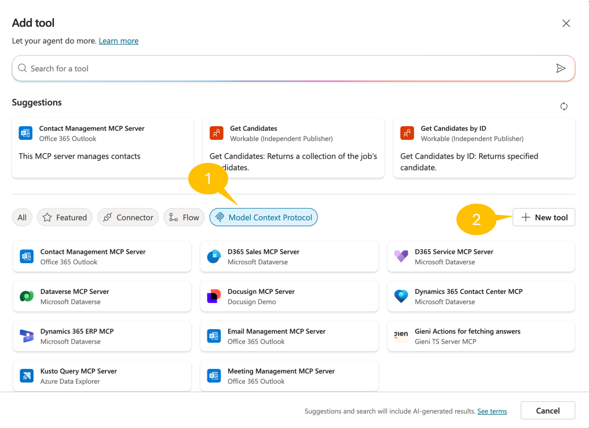

A new dialog shows up allowing you to select the kind of tool that you want to add. Select the **Model Context Protocol** option.

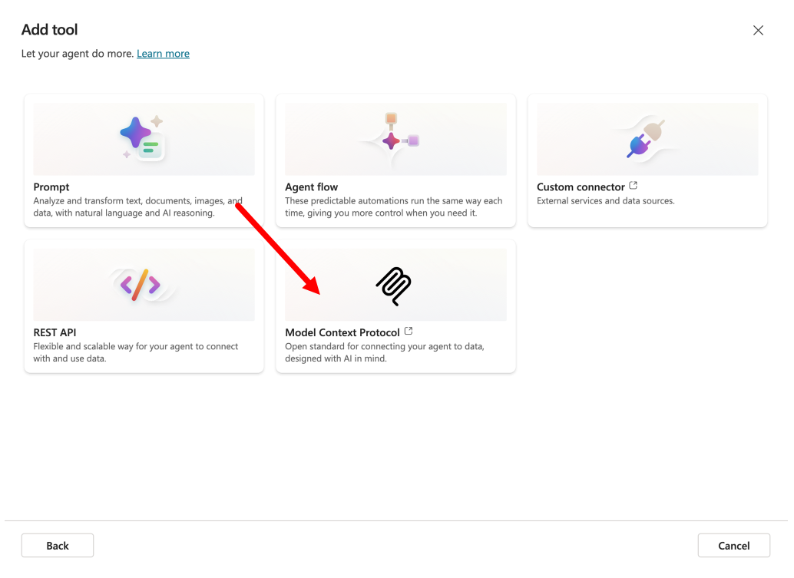

A new dialog will open, allowing you to configure the new MCP server providing name, description, URL, and authentication method.

Provide a name for the MCP server, for example:

`HR MCP Server`

Provide a description, for example:

`Allows managing a list of candidates for the HR department`

Configure the URL of the server, providing the URL that you copied from the dev tunnel with name `[Connect via browser of your dev tunnel]`.

Select **None** as the authentication method and then select **Create** to configure the actual tool.

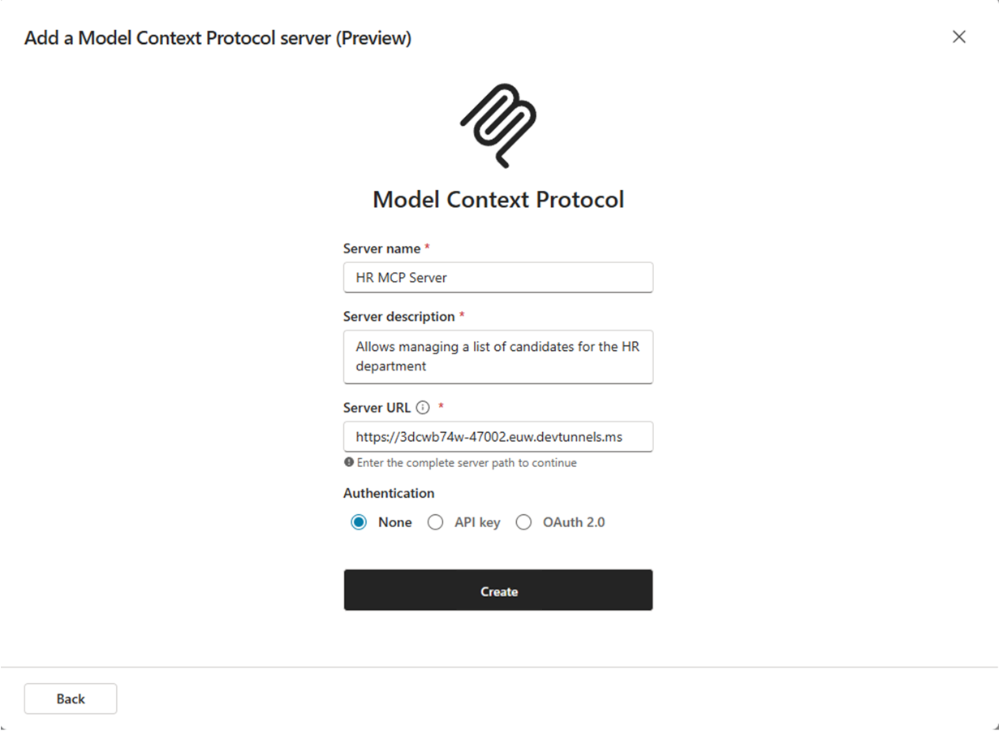

Once the tool will get created, you will see a new dialog window requesting you to connect to the MCP server.

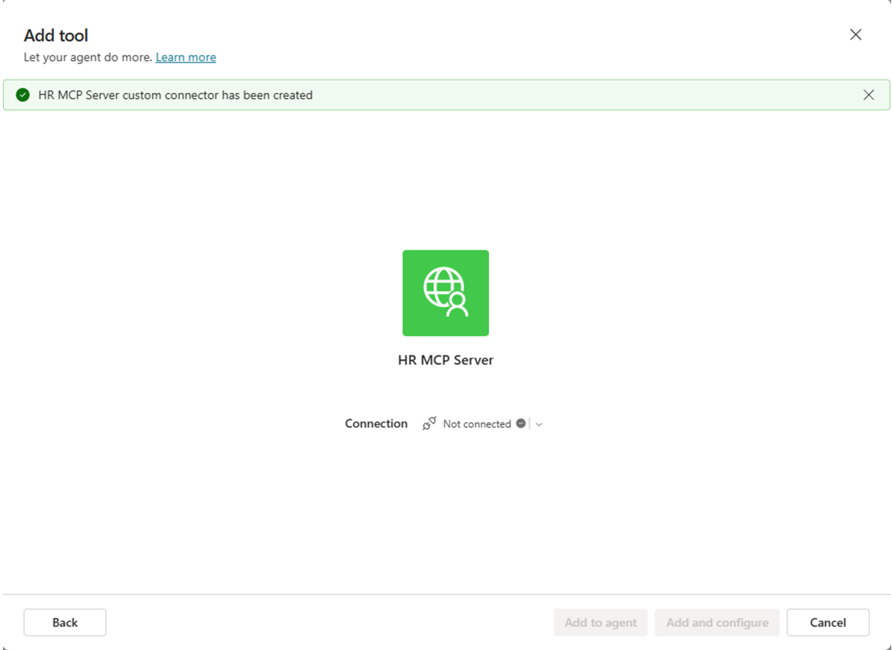

Select the `Not connected` option and then select **Create a new connection**. Follow the steps and you will be able to connect to the target MCP server.

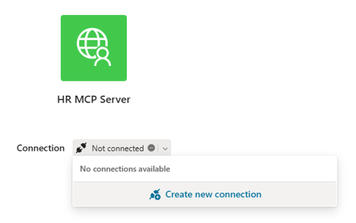

Once the connection is completely configured, you can select the **Add and configure** command in the dialog window and see the MCP server and tools properly configured.

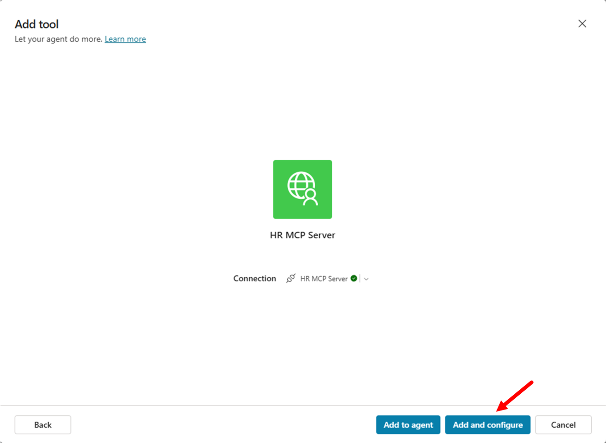

All the tools exposed by the MCP server are now available to your agent, as you can verify in the window displaying the MCP server details and tools.

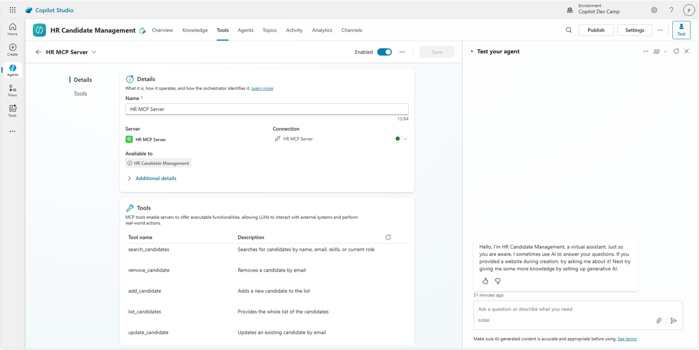

<cc-end-step lab="mcs6" exercise="3" step="1" />

### Step 2: Test the new MCP server integration

Publish your agent by selecting **Publish** in the top right corner. Once published, test the agent in the integrated Test panel using the following prompt:

```text
List all candidates
```

The agent should use the MCP server's `list_candidates` tool to return a complete list of all candidates in your HR system.
However, in order to being able to consume the list of candidates you will need to connect to the target connector. As such, Copilot Studio will ask you to **Open connection manager**, connect to the MCP server, and then **Retry** the request.

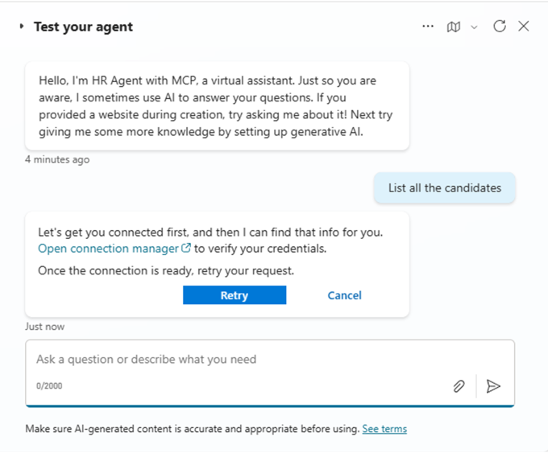

Once the connection is established, you can get the actual list of candidates from the HR MCP server.


!!! tip "Debugging the MCP server locally"
    If you are a developer and you like to dig into the MCP server implementation, you can add breakpoints to the `HRTools.cs` file and attach a debugger from Visual Studio Code. You will be able to dig into the code and debug the actual MCP server in action.

You can also make the agent available in the Microsoft 365 Copilot Chat. Select the 1️⃣ **Channels** section, then select the 2️⃣ **Teams and Microsoft 365 Copilot** channel, check the 3️⃣ **Make agent available in Microsoft 365 Copilot** option, and then select the 4️⃣ **Add channel** command. Wait for the channel to be enabled, then close the channel side panel and publish the agent again selecting the **Publish** command of the agent in the top right corner.

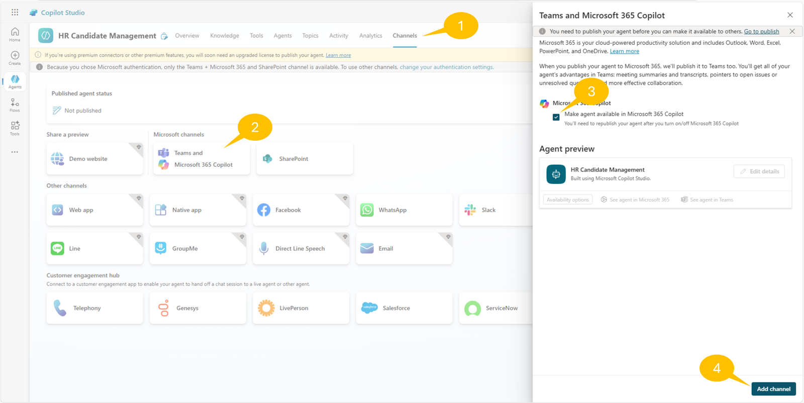

Now, open the **Teams and Microsoft 365 Copilot** channel again and select the command **See agent in Microsoft 365** to add the agent to Microsoft 365 Copilot.

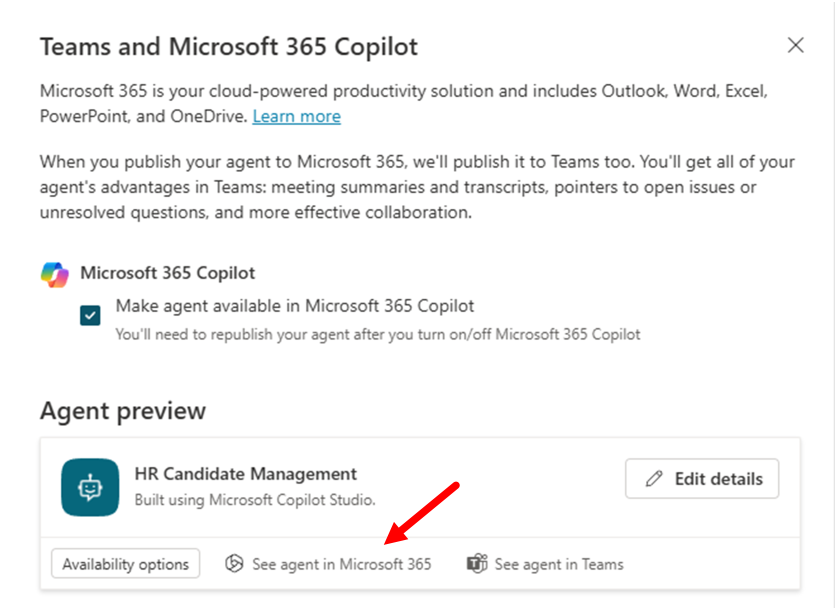

You will see the interface to add the agent to Microsoft 365 Copilot, select **Add** and then **Open**, in order to play with the agent in Microsoft 365 Copilot.

!!! info "Agent details"
    If you like, through the **Teams and Microsoft 365 Copilot** channel configuration panel, you can also provide additional details about the agent like a description, a custom icon, etc.


You can now play with the agent in Microsoft 365 Copilot, notice the suggested prompts in the UI of the agent.
Now, for example, you can try with another prompt like:

```text
Search for candidate Alice
```

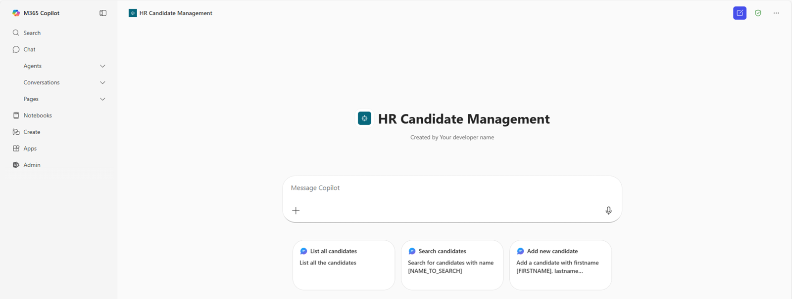

Now the agent should use the MCP server's `search_candidates` tool and return only one candidate matching the search criteria.
However, since we are in the Microsoft 365 Copilot context, you will need to connect again to the MCP server, using the Microsoft Copilot Studio connections management interface.


Once connected, you will be able to run again the prompt and get the expected response.


It is now time to test a much more advanced tool, like the `add_candidate` one to add a new candidate to the HR system. Use the following prompt:

```text
Add a new candidate: John Smith, Software Engineer, skills: React, Node.js, 
email: john.smith@email.com, speaks English and Spanish
```

The agent will understand your intent, will extract the input arguments for the `add_candidate` tool, and will invoke it adding a new candidate to the list. The response from the MCP server will be a simple confirmation.


You can double check the outcome by listing again the whole list of candidates. You can find `John Smith` as a new candidate at the end of the list.


You can also have fun with other prompts like:

```text
Update the candidate with email bob.brown@example.com to speak also French
```

or:

```text
Add skill "Project Management" to candidate bob.brown@example.com
```

or:

```text
Remove candidate bob.brown@example.com
```

The agent will invoke the right tools for you and will act accordingly to your prompts.

Well done! Your agent is fully functional and capable of consuming all the tools exposed by the HR MCP server.

<cc-end-step lab="mcs6" exercise="3" step="2" />

---8<--- "mcs-congratulations.md"

You have completed Lab MCS6 - Consuming an MCP server!

<a href="../07-autonomous">Start here</a> with Lab MCS7, to learn how to create autonomous agents in Copilot Studio.
<cc-next /> 

