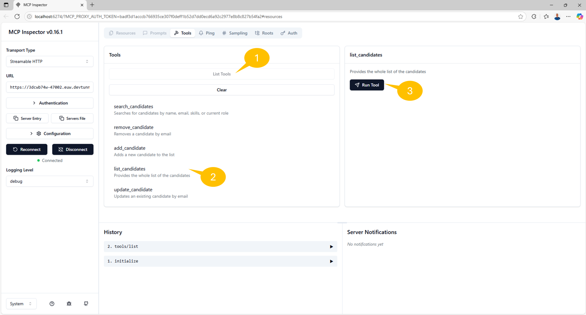
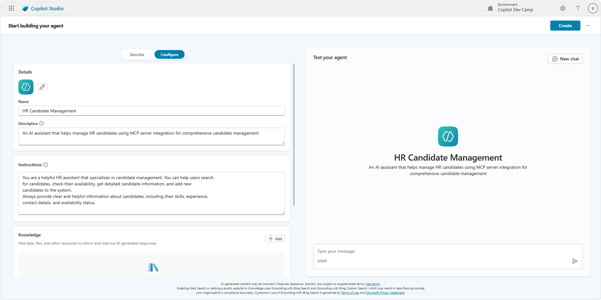
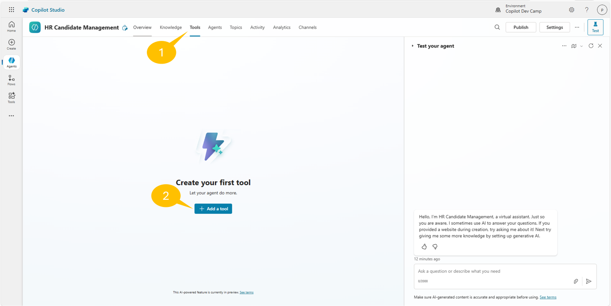

# Lab MCS6 - Consuming an MCP server

In this lab, you are going to understand how to extend an agent made with Microsoft Copilot Studio using an MCP (Model Context Protocol) server. Specifically, you are going to consume an existing MCP server that provides knowledge and tools for managing a hypothetical list of candidates for a job role. The MCP server will offer functionalities to:

- List all candidates 
- Search for candidates by criteria
- Add new candidates 
- Update existing candidate information
- Remove candidates 

<div class="lab-intro-video">
    <div style="flex: 1; min-width: 0;">
        <iframe  src="//www.youtube.com/embed/???" frameborder="0" allowfullscreen style="width: 100%; aspect-ratio: 16/9;">          
        </iframe>
          <div>Get a quick overview of the lab in this video.</div>
    </div>
    <div style="flex: 1; min-width: 0;">
   ---8<--- "mcs-labs-prelude.md"
    </div>
</div>

!!! tip "Learn about MCP"
    This lab introduces MCP concepts and shows how to integrate them with Copilot Studio. MCP is a new protocol that allows AI assistants to securely connect to external data sources and tools. You can learn more about MCP reading the content available in the [Model Context Protocol (MCP) for beginners](https://github.com/microsoft/mcp-for-beginners){target=_blank} training class.

In this lab you will learn:

- How to configure and connect to an existing MCP server
- How to consume MCP tools and resources from an external server
- How to integrate MCP servers with Copilot Studio agents

## Exercise 1 : Setting up the MCP Server

In this exercise you are going to setup a pre-built MCP server that provides HR candidates management functionality. The server is based on Microsoft .NET and relies on the MCP SDK for C#. The server provides tools to manage a hypothetical list of job candidates. In this exercise you are going to download and configure the server, so that you can run it locally.

### Step 1: Understanding the MCP Server and prerequisites

The HR MCP server that you will be consuming in this lab provides the following tools:

- **list_candidates**: Provides the whole list of candidates
- **search_candidates**: Searches for candidates by name, email, skills, or current role
- **add_candidate**: Adds a new candidate to the list
- **update_candidate**: Updates an existing candidate by email
- **remove_candidate**: Removes a candidate by email

The server manages candidates information including:

- Personal details (firstname, lastname, full name, email)
- Professional information (spoken languages, skills, current role)

Before starting, make sure you have:

- [.NET 10.0 SDK (preview 6 or higher)](https://dotnet.microsoft.com/download/dotnet/10.0){target=_blank}
- [Visual Studio Code](https://code.visualstudio.com/){target=_blank}
- [Node.js v.22 or higher](https://nodejs.org/en){target=_blank}
- [MCP Inspector](https://github.com/modelcontextprotocol/inspector){target=_blank}

<cc-end-step lab="mcs6" exercise="1" step="1" />

### Step 2: Downloading and running the MCP Server

For this lab, you will use a pre-built HR MCP server. Download the server files [from here](https://download-directory.github.io/?url=https://github.com/microsoft/copilot-camp/tree/main/src/make/copilot-studio/path-m-lab-mcs6-mcp/hr-mcp-server&filename=hr-mcp-server){target=_blank}.

Extract the files from the zip and open the target folder with Visual Studio Code. The server is already implemented and ready to run.


The main elements of the project outline are:

- `Configuration`: folder with the `HRMCPServerConfiguration.cs` file defining the configuration settings for the MCP server.
- `Data`: folder with the `candidates.json` file providing the list of candidates.
- `Services`: folder with the `ICandidateService.cs` interface and the actual `CandidateService.cs` implementation of a service to load and manage the list of candidates.
- `Tools`: folder with the `HRTools.cs` file defining the MCP tools and the `Models.cs` file defining the data models used by the tools.
- `DevTunnel_Instructions.MD`: instructions about how to expose the MCP server via a dev tunnel.
- `Progam.cs`: the main entry point of the project, where the MCP server gets initialized.

Open a new terminal window from within Visual Studio Code or simply start a new terminal window, and then install dependencies, build, and start the .NET project by invoking the following command:

```console
dotnet run
```

Check that the MCP server is up and running. You should be able to consume the server via browser at the URL [http://localhost:47002/](http://localhost:47002/){target=_blank}. You will see an error inside a JSON message, that's ok. It means that you are reaching the MCP server.

<cc-end-step lab="mcs6" exercise="1" step="2" />

### Step 3: Configure the dev tunnel

Now, you need to expose the MCP server with a public URL. Since you are running the server locally on your development machine, you need to rely on a reverse proxy tool to expose your `localhost` via a public URL. For the sake of simplicity, you can use the dev tunnel tool provided by Microsoft, following these steps:

- Install dev tunnel on your environment following [these instructions](https://learn.microsoft.com/en-us/azure/developer/dev-tunnels/get-started){target=_blank}
- Login with dev tunnel, executing the following command:

```console
devtunnel user login
```

- Host your dev tunnel, executing the following commands:

```console
devtunnel create hr-mcp -a --host-header unchanged
devtunnel port create hr-mcp -p 47002
devtunnel host hr-mcp
```

The command line will display the connection information, such as:


Copy the "Connect via browser" URL and save it in a safe place. Open a browser and navigate to the just copied URL. You might need to confirm that you want to consume the MCP server via the dev tunnel through a confirmation page like the following one.


Be sure to leave the dev tunnel command running as you do the exercises in this lab. If you need to restart it, just repeat the last command `devtunnel host hr-service`.

<cc-end-step lab="mcs6" exercise="1" step="3" />

### Step 4: Testing the MCP server

You are now ready to test the MCP server on your local environment. For the sake of simplicity, you can use the [MCP Inspector](https://github.com/modelcontextprotocol/inspector){target=_blank}. Start a terminal window and run the following command:

```console
npx @modelcontextprotocol/inspector
```

The Node.js engine will download and run the MCP Inspector, in the terminal window you should see an output like the following one.


The browser will start automatically and you will see the following interface.


Configure the MCP Inspector with the following settings:

- 1️⃣ **Transport type**: Streamable HTTP
- 2️⃣ **URL**: the URL that you saved from the "Connect via browser" of the dev tunnel

Then select the 3️⃣ **Connect** button to start consuming the MCP server. The connection should be successful, and you should be able to have a green bullet and the message **Connected** just below the connection handling commands.
Now, in the Tools section of the screen, select the 1️⃣ **List Tools** command to retrieve the list of tools exposed by the MCP server.
Then, select the 2️⃣ **list_candidates** tool, and then select 3️⃣ **Run tool** to invoke the selected tool.



In case of successful response, you will see a **Success** message in green and the output of the tool invocation.
In the **History** section you can always review all the invocations sent to the MCP server.


You are now ready to consume the MCP server from an agent in Microsoft Copilot Studio.

<cc-end-step lab="mcs6" exercise="1" step="4" />

## Exercise 2 : Creating a New Agent in Copilot Studio

In this exercise you are going to create a new agent in Microsoft Copilot Studio that will consume the MCP server you configured in Exercise 1.

### Step 1: Creating the new agent

Open a browser and, using the work account of your target Microsoft 365 tenant, go to [https://copilotstudio.microsoft.com](https://copilotstudio.microsoft.com){target=_blank} to start using Microsoft Copilot Studio.

Select the `Copilot Dev Camp` environment, and then select **Create** in the left navigation menu, then choose **Agent** to create a new agent.

Choose to **Skip to configure** and define your new agent with the following settings:

- **Name**: `HR Agent with MCP`
- **Description**: `An AI assistant that helps manage HR candidates using MCP server integration for comprehensive candidate management`
- **Instructions**: `You are a helpful HR assistant that specializes in candidate management. You can help users search for candidates, check their availability, get detailed candidate information, and add new candidates to the system. Always provide clear and helpful information about candidates, including their skills, experience, contact details, and availability status.`



Select **Create** to create your new agent.

<cc-end-step lab="mcs6" exercise="2" step="1" />

### Step 2: Configuring the agent's knowledge and conversation starters

After creating the agent, you'll be taken to the agent configuration page. In the **Suggested prompts** section, add these helpful prompts:

1. Title: `List all candidates` - Prompt: `List all the candidates`
1. Title: `Search candidates` - Prompt: `Search for candidates with name [NAME_TO_SEARCH]`
1. Title: `Add new candidate` - Prompt: `Add a candidate with firstname [FIRSTNAME], lastname [LASTNAME],  e-mail [EMAIL], role [ROLE], spoken languages [LANGUAGES], and skills [SKILLS]`


Select the **Save** button to confirm your changes.

<cc-end-step lab="mcs6" exercise="2" step="2" />

## Exercise 3 : Integrating MCP Server with Copilot Studio

In this exercise you are going to configure the integration between your MCP server and the Copilot Studio agent.

### Step 1: Adding MCP server as a knowledge source

In your HR Agent with MCP agent, navigate to the 1️⃣ **Tools** section and select 2️⃣ **+ Add Tool**.



Choose 1️⃣ **Model Context Protocol** group to see all the already existing tools available to you agent via MCP. Now select 2️⃣ **+ New tool** to add the actual tools.


A new dialog will show up allowing you to select the kind of tool that you want to add. At the time of this writing, if you select the **Model Context Protocol** option, you will be brought to the official documentation page [Extend your agent with Model Context Protocol](https://learn.microsoft.com/en-us/microsoft-copilot-studio/agent-extend-action-mcp){target=_blank} that explains you how to add a new MCP server as a Power Platform custom connector.

In this lab we are going to create the actual custom connector for the MCP server. So, select **Custom connector** and proceed with the following steps. 


A new browser tab will open, providing you access to the Power Apps page to configure custom connectors. Select 1️⃣ **+ New custom connector** and then 2️⃣ **Import an OpenAPI file**.

Keep this process on hold, move to Visual Studio Code, create a new file, and paste the following YAML schema into it.

```yaml
swagger: '2.0'
info:
  title: Contoso
  description: HR MCP Server Specification, YAML for streamable MCP support in Copilot Studio
  version: 1.0.0
host: [Connect via browser host name of your dev tunnel]
basePath: /
schemes:
  - https
paths:
  /mcp:
    post:
      summary: HR MCP Server
      x-ms-agentic-protocol: mcp-streamable-1.0
      operationId: InvokeMCP
      responses:
        '200':
          description: Success
```

Replace the `host` with the actual hostname of your dev tunnel public URL.

Configure the MCP server connection:

- **Server Name**: `HR Candidate MCP Server`
- **Description**: `MCP server providing HR candidate management tools and data`
- **Connection Type**: `Local Server` (for development) or `HTTP/HTTPS` (for deployed servers)
- **Server Path**: Path to your MCP server executable or connection details
- **Authentication**: Configure if needed for your deployment


<cc-end-step lab="mcs6" exercise="3" step="1" />

### Step 2: Mapping MCP tools to agent actions

Once the MCP server is connected, Copilot Studio will automatically discover the available tools. Map each tool to appropriate agent actions:

**List Candidates Tool**:
- **Action Name**: `List All Candidates`
- **Description**: `List all candidates in the HR database`
- **When to use**: When users ask to see all candidates or get an overview

**Search Candidates Tool**:
- **Action Name**: `Search HR Candidates`
- **Description**: `Search for candidates by name, skills, position, or other criteria`
- **When to use**: When users ask to find or search for specific candidates

**Add Candidate Tool**:
- **Action Name**: `Add New Candidate`
- **Description**: `Add a new candidate to the HR database`
- **When to use**: When users want to add new candidates to the system

**Update Candidate Tool**:
- **Action Name**: `Update Candidate Information`
- **Description**: `Update existing candidate information in the database`
- **When to use**: When users want to modify or update candidate details

**Remove Candidate Tool**:
- **Action Name**: `Remove Candidate`
- **Description**: `Remove a candidate from the HR database`
- **When to use**: When users want to delete or remove candidates from the system


Select **Save** to save the MCP integration configuration.

<cc-end-step lab="mcs6" exercise="3" step="2" />

### Step 3: Testing the agent with MCP integration

Publish your agent by selecting **Publish** in the top right corner. Once published, test the agent using the conversation starters:

**Test 1 - List All Candidates**:
```text
List all candidates in the database
```

The agent should use the MCP server's `list_candidates` tool and return a complete list of all candidates in your HR database.

**Test 2 - Candidate Search**:
```text
Search for candidates with JavaScript skills
```

The agent should use the MCP server's `search_candidates` tool and return a list of candidates with JavaScript skills from your HR database.


**Test 3 - Add New Candidate**:
```text
Add a new candidate: John Smith, Software Engineer, skills: React, Node.js, email: john.smith@email.com
```

The agent should use the `add_candidate` tool to add the new candidate to the HR database.

**Test 4 - Update Candidate**:
```text
Update candidate ID 1 with new email: newemail@example.com
```

The agent should use the `update_candidate` tool to modify the existing candidate information.

**Test 5 - Remove Candidate**:
```text
Remove candidate ID 5 from the database
```

The agent should use the `remove_candidate` tool to delete the candidate from the HR database.


<cc-end-step lab="mcs6" exercise="3" step="3" />

## Exercise 4 : Advanced MCP Integration Features

In this exercise you will explore advanced MCP integration features and best practices for your HR Agent.

### Step 1: Configuring advanced MCP settings

Navigate back to your MCP server configuration in Copilot Studio and explore the advanced settings:

**Connection Settings**:
- Configure timeout settings for MCP tool calls
- Set up retry policies for failed connections
- Enable logging for debugging purposes

**Security Configuration**:
- Review authentication options if your MCP server requires it
- Configure access permissions for different user roles
- Set up data privacy and compliance settings


<cc-end-step lab="mcs6" exercise="4" step="1" />

### Step 2: Monitoring and performance optimization

Monitor your MCP integration to ensure optimal performance:

**Usage Analytics**:
- Review which MCP tools are being used most frequently
- Monitor response times for different tool calls
- Analyze user interaction patterns with HR data

**Performance Optimization**:
- Optimize frequently used queries for faster responses
- Consider caching strategies for static candidate data
- Review and optimize tool parameter validation


<cc-end-step lab="mcs6" exercise="4" step="2" />

### Step 3: Extending functionality with custom prompts

Enhance your HR Agent with more sophisticated conversation patterns:

**Advanced Conversation Scenarios**:
```text
"List all candidates and show me their current status"

"Search for Senior Frontend Developer candidates with React experience and 5+ years in the field"

"Add a new candidate: Sarah Johnson, Full Stack Developer, skills: Python, Django, PostgreSQL, email: sarah.j@email.com"

"Update candidate ID 3's status to 'Interview Scheduled' and add availability note"

"Remove candidate ID 7 from the system as they've withdrawn their application"
```

**Custom Action Combinations**:
Configure the agent to chain multiple MCP tool calls for complex workflows:
- List candidates → Search specific criteria → Update status in a single conversation
- Add candidate → Validate information → Update with additional details
- Search candidates → Compare multiple candidates → Update or remove as needed


<cc-end-step lab="mcs6" exercise="4" step="3" />

---8<--- "mcs-congratulations.md"

You have completed Lab MCS6 - Consuming an MCP server!

In this lab, you learned how to:

- Connect to and configure an existing MCP server for HR candidate management
- Set up a new HR Agent in Microsoft Copilot Studio  
- Integrate MCP servers as knowledge sources in Copilot Studio
- Map MCP tools to agent actions for seamless HR workflows
- Test and validate the MCP integration with candidate data
- Implement advanced features like monitoring and custom conversation patterns

The Model Context Protocol provides a powerful way to extend Copilot Studio agents with external HR tools and candidate databases, enabling rich, context-aware conversations for recruiting and talent management.

<!-- <cc-award path="Make" /> -->

