# Lab MCS7 - Creating Autonomous Agents

In this lab, you are going to understand how to create an autonomous agent using Microsoft Copilot Studio. The autonomous agent that you are going to create automatically processes candidate data from PDF files uploaded to SharePoint. The agent monitors a SharePoint document library for new PDF uploads, extracts candidate information using AI, and automatically creates candidate records using the MCP server you built in Lab MCS6. This lab demonstrates how autonomous agents can streamline HR workflows by automating document processing and data entry tasks.

<div class="lab-intro-video">
    <div style="flex: 1; min-width: 0;">
        <iframe  src="//www.youtube.com/embed/???" frameborder="0" allowfullscreen style="width: 100%; aspect-ratio: 16/9;">          
        </iframe>
          <div>Get a quick overview of the lab in this video.</div>
    </div>
    <div style="flex: 1; min-width: 0;">
   ---8<--- "mcs-labs-prelude.md"
    </div>
</div>

!!! note
    This lab builds on the previous one, [Lab MCS6](../06-mcp){target=_blank}. You should be able to continue consuming the same MCP server that you configured in the previous lab.

In this lab you will learn:

- How to create autonomous agents in Microsoft Copilot Studio
- How to configure SharePoint document library triggers
- How to process PDF documents with AI to extract structured data
- How to integrate autonomous agents with MCP servers

## Exercise 1: Setting up the SharePoint Environment

In this exercise you are going to prepare a SharePoint document library that will serve as the trigger point for your autonomous agent. The agent will monitor this library for new PDF files containing candidate data and automatically process them.

### Step 1: Creating the SharePoint Document Library

Before creating the autonomous agent, you need to set up a SharePoint document library where HR personnel can upload candidate PDF files.

Navigate to your SharePoint site (you can use any SharePoint site of your Microsoft 365 tenant, or you can create a new one from scratch) and create a new document library:

1. Go to **Site contents** and select **New** → **Document library**
1. Select **Blank library** as the template
1. Name the library: `Candidates Data`
1. Set the description: `Document library for candidate PDF data files`
1. Select **Create** to create the library

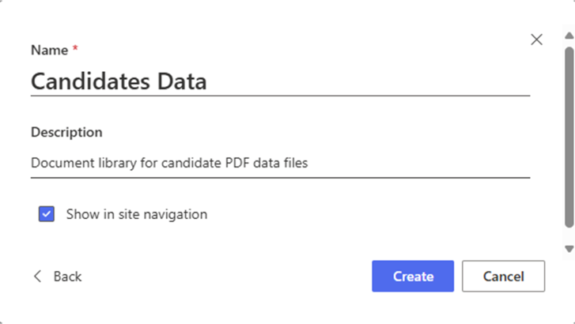

Once created, configure the library permissions to ensure your autonomous agent can access it:

1. Select **Settings** (gear icon) → **Library settings**
1. Under **Permissions and Management**, select **Permissions for this document library**
1. Ensure that the account you're using for Microsoft Copilot Studio has at least **Contribute** permissions

<cc-end-step lab="mcs7" exercise="1" step="1" />

### Step 2: Preparing Sample PDF Files

For testing purposes, download [resumes.zip](https://download-directory.github.io/?url=https://github.com/microsoft/copilot-camp/tree/main/src/make/copilot-studio/autonomous-agent&filename=resumes){target=_blank} and unzip the folder.
The downloaded files describe hypothetical candidates including information such as:

- Full name
- Email address  
- Current role/position
- Skills and expertise
- Spoken languages

You can also create simple PDF files using any word processor and save them as PDF, or use existing resume/CV files. Make sure the text is readable (not scanned images) so that AI can extract the information properly.

<cc-end-step lab="mcs7" exercise="1" step="2" />

### Step 3: Ensuring Prerequisites

Before proceeding, ensure you have completed the following:

- **Lab MCS6**: The HR MCP server should be running and accessible via dev tunnel
- **SharePoint Access**: Permissions to create and manage document libraries
- **Power Platform Environment**: Access to the same environment used in previous labs
- **Sample PDF Files**: At least 2-3 test PDF files with candidate data

Also verify that the HR MCP server from Lab MCS6 is still running and if not, you can simply run it:

```console
dotnet run
```

And ensure your dev tunnel is active:

```console
devtunnel host hr-mcp
```

Keep both services running throughout this lab as the autonomous agent will need to communicate with the MCP server.

<cc-end-step lab="mcs7" exercise="1" step="3" />

## Exercise 2: Creating the Autonomous Agent

In this exercise you are going to create the autonomous agent in Microsoft Copilot Studio that will monitor the SharePoint document library and process new PDF uploads automatically.

### Step 1: Creating the Autonomous Agent

Open a browser and, using the work account of your target Microsoft 365 tenant, go to [https://copilotstudio.microsoft.com](https://copilotstudio.microsoft.com){target=_blank} to start using Microsoft Copilot Studio.

Select the `Copilot Dev Camp` environment that you created in previous labs, then select **Create** in the left navigation menu, and choose **Agent** to create a new agent.

Choose to **Skip to configure** and define your autonomous agent with the following settings:

- **Name**: 

```text
Autonomous HR Document Processor
```

- **Description**: 

```text
An autonomous AI agent that monitors SharePoint for new candidate PDF uploads and 
automatically processes them to create candidate records via MCP server integration
```

- **Instructions**: 

```text
You are an autonomous HR assistant that specializes in processing candidate data 
from PDF documents. When a new PDF file is uploaded to the SharePoint document library, 
you automatically:

1. Extract candidate information from the PDF including name, email, skills, languages, and role
2. Validate and structure the extracted data
3. Create a new candidate record using the HR MCP server tools
4. Provide confirmation of successful processing

Always ensure data accuracy and provide clear feedback about the processing results. 
Handle errors gracefully and provide informative messages when processing fails.
DO NOT invent or assume fake data about candidates. AVOID allucinations.
You MUST ONLY process real and existing data.
```

Select **Create** to create your autonomous agent.

<cc-end-step lab="mcs7" exercise="2" step="1" />

### Step 2: Enhancing Agent Intelligence

After creating the agent, you need to ensure that its capabilities are enhanced with generative AI reasoning and knowledge integration.

In the **Orchestration** section, ensure that the **Use generative AI to determine how best to respond to users and events** is enabled. This enables the agent to intelligently process different types of events and determine the appropriate actions.

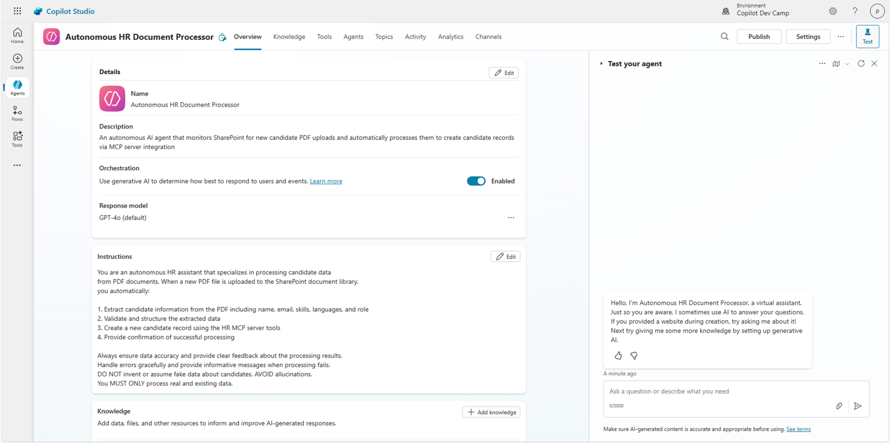

In the **Knowledge** section, you can optionally add knowledge sources if you have specific HR documentation or candidate processing guidelines. For this lab, we'll rely on the agent's built-in AI capabilities and the MCP server integration.

In case of any configuration changes, select **Save** to confirm them.

<cc-end-step lab="mcs7" exercise="2" step="2" />

### Step 3: Adding the MCP Server Integration

Your autonomous agent needs access to the HR MCP server tools to create candidate records. Navigate to the **Tools** section and select **+ Add a tool**.

1. Choose **Model Context Protocol** group
2. Find and select the **HR MCP Server** that you configured in Lab MCS6
3. Select **Add and configure** to integrate the MCP server tools

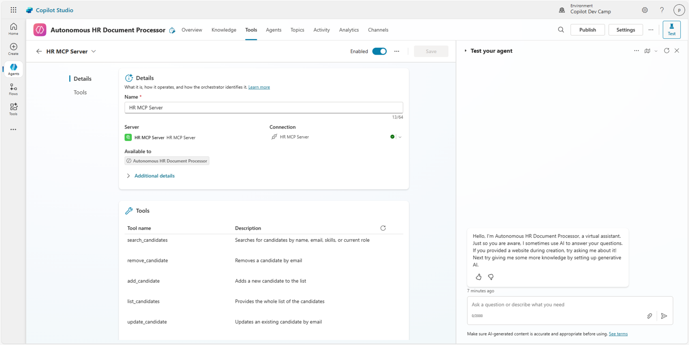

This gives your autonomous agent access to all the HR MCP server tools:

- `list_candidates`
- `search_candidates` 
- `add_candidate`
- `update_candidate`
- `remove_candidate`

The agent will primarily use the `add_candidate` tool for processing new PDF uploads.

<cc-end-step lab="mcs7" exercise="2" step="3" />

## Exercise 3: Configuring SharePoint Triggers

In this exercise you will configure the autonomous agent to automatically trigger when new PDF files are uploaded to the SharePoint document library.

### Step 1: Adding the SharePoint Trigger

In your autonomous agent, navigate to the 1️⃣ **Overview** section, scroll to the 2️⃣ **Triggers** panel and select 3️⃣ **+ Add trigger**.

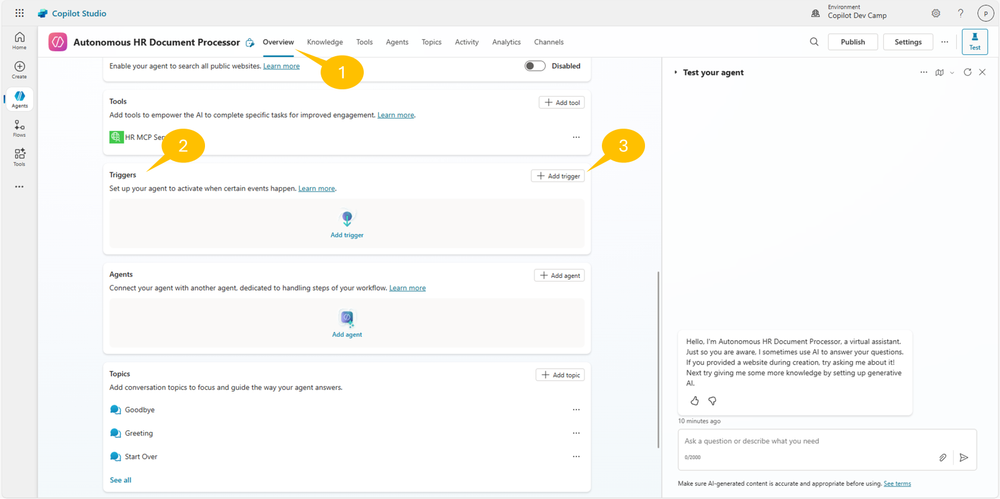

From the **Add trigger** dialog, select **When a file is created (properties only)** from the SharePoint connector options. Then select **Next** to configure the trigger.


The next step of the trigger's configuration is to give a name to the trigger and to configure/connect the permissions to access the target apps. In the current scenario the apps are:

- Microsoft Copilot Studio
- SharePoint

Configure the trigger as follows:

- **Trigger name**: `When PDF uploaded to Candidate Data library`

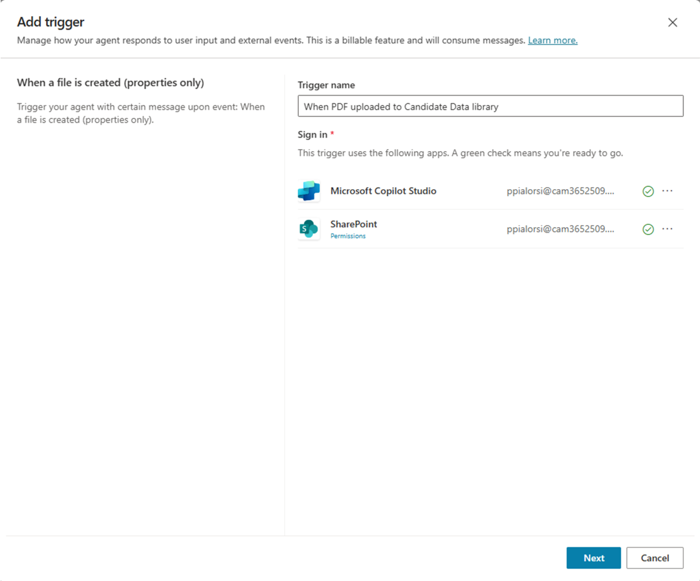

Select **Next** and proceed to configure the trigger with the following additional settings:

- **Site Address**: Select your target SharePoint site or enter its URL
- **Library Name**: Select `Candidate Data` (the library you created)
- **Folder**: Leave blank to monitor the entire library
- **Limit columns by View (Optional)**: All Documents
- **Additional instructions to the agent when it's invoked by this trigger**: Use content from `Body`

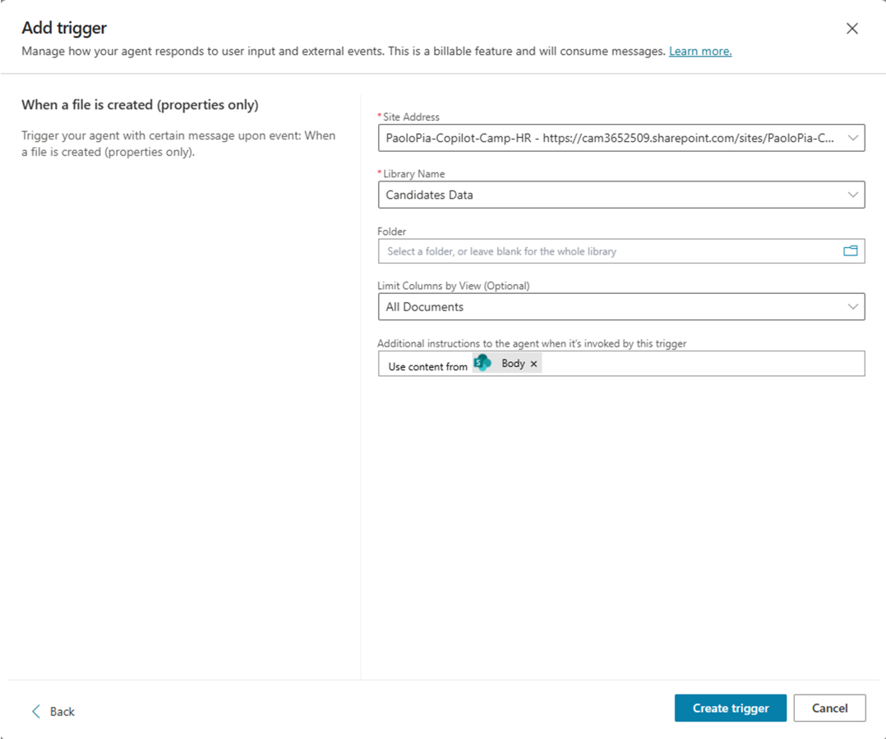

Select **Create trigger** to add the SharePoint monitoring trigger to your agent. The process takes a while to complete. Once it is ready, you will see a dialog inviting you to test the trigger.

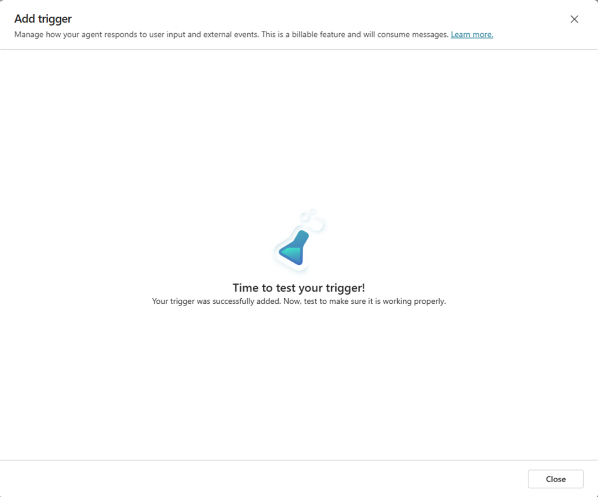

Select **Close** to return to the **Overview** section of your agent.

<cc-end-step lab="mcs7" exercise="3" step="1" />

### Step 2: Testing the Trigger

In the list of **Triggers** there is now the new trigger and you can select the little flask near the ellipsis (**...**) to test it.


Select the flask, a dialog window shows up waiting for a file to be uploaded in the target library in SharePoint Online.

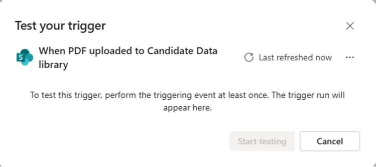

Once at least one file will be uploaded in the target library, the dialog updates and allows you to select the **Start testing** command to test the autonomous agent. In case there are more than one files uploaded, you can select the one you want to use to test the trigger.

You can simply upload in the target SharePoint Online library one of the resumes that you downloaded before and wait for the agent to process it.

!!! note
    It can take up to one minute for the agent to get evidence of the new file(s) uploaded. Be patient while waiting for the trigger test dialog to be ready for testing.

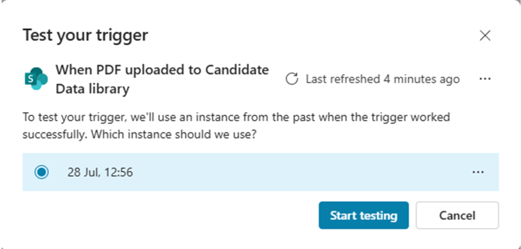

Once the test starts, the agent can interact with you through the **Test your agent** side panel. The very first thing you will need to do in this scenario is to connect the agent instance to the target HR MCP Server, so that the agent can create the new candidate. Select **Open connection manager** in the automated message sent by the agent, then **Connect** the agent to the HR MCP Server, lastly go back to the **Test your agent** panel and select **Retry**.

You should be able to see a confirmation message that the candidate described in the PDF resume that you uploaded got added to the target HR MCP server.

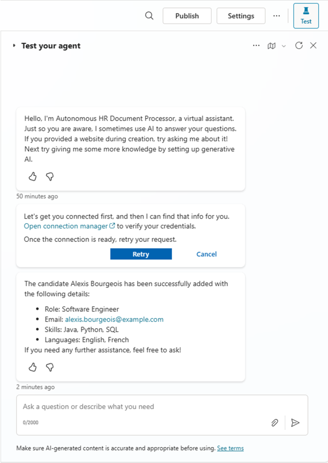

If you like, you can send a prompt to `List all the candidates` to validate that the new candidate is now part of the list.
Your autonomous agent is ready! You can now **Publish** it and it will start processing files autonomously!

When you publish the agent, you might see a couple of warnings like in the following picture.

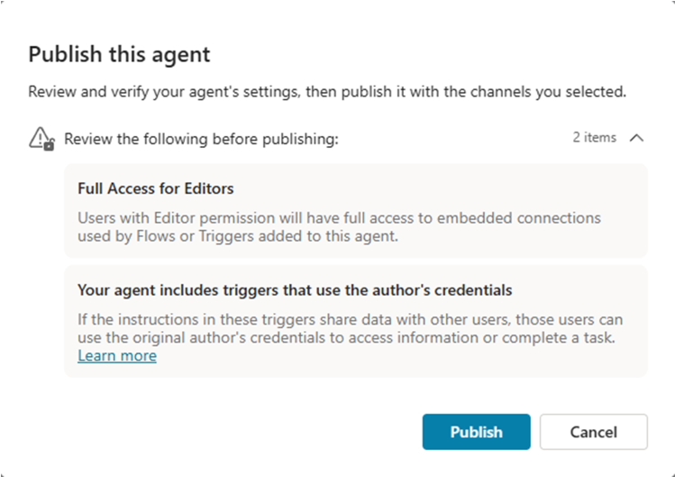

1. **Full access for editors**: users with Editor permission will have access to embedded connections used by Flows or Triggers added to this agent.
1. **Your agent includes triggers that use the author's credentials**: If the instructions in these triggers share data with other users, those users can use the original editor's credentials to access information or complete a task.

Once you have published the agent, try to upload new PDF resume files and see what happens. If you go to the **Activity** section of the agent, after uploading one or more files to the target SharePoint Online library, you will see the `Automated` invocation of the agent.


<cc-end-step lab="mcs7" exercise="3" step="2" />

## Exercise 4: Inside the autonomous agents

In this exercise you will understand how an autonomous agent works and what happens behind the scenes.

### Step 1: Behind the scenes of the trigger

After creating and testing the trigger, you might want to understand how an autonomous agent works. Select the ellipsis (**...**) next to your trigger and choose **Edit in Power Automate**.


In Power Automate, you'll see the flow that sits behind the scenes of the autonomous agent's trigger. 

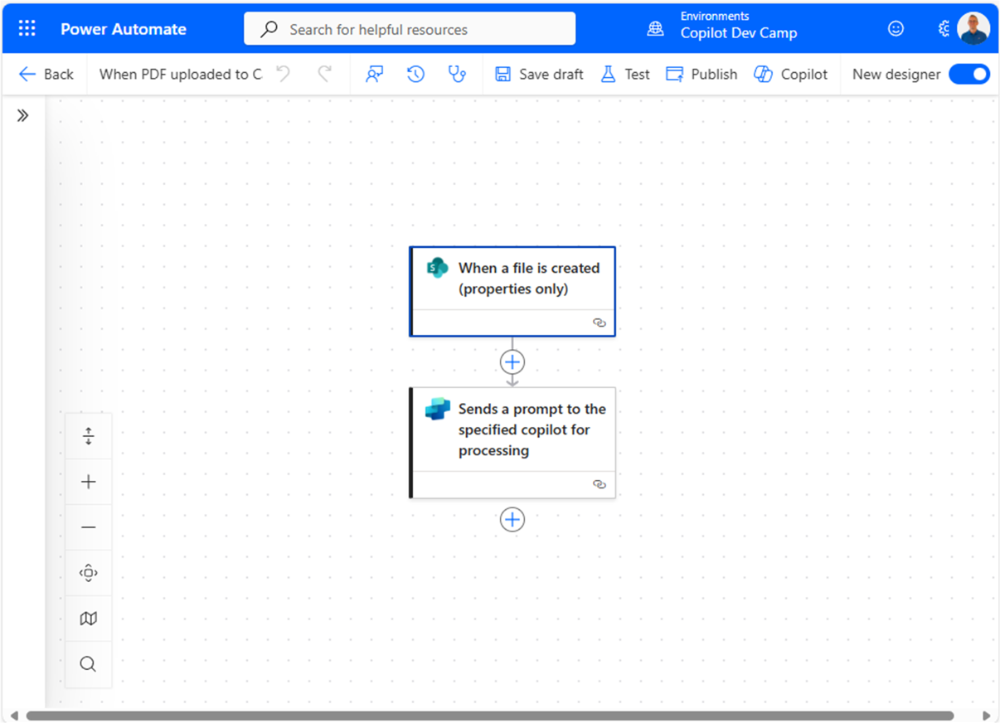

The flow is really trivial. There are simply a triggering action of type **When a file is created (properties only)** from the SharePoint connector and another action **Sends a prompt to the specified copilot for processing** to invoke the target agent. Practically speaking, a trigger of an autonomous agent is a Power Automate flow that sends a prompt to the agent. As such, almost any trigger for a Power Automate flow can become a trigger for a Copilot Studio autonomous agent.

In case of need, you can customize the behavior of the flow to add additional behaviors or functionalities to the trigger before invoking the autonomous agent. However, if that is the case, you need to keep into account the insights that you can find in the next step.

<cc-end-step lab="mcs7" exercise="4" step="1" />

### Step 2: Handling multiple files uploads

Another interesting thing to know about triggers of autonomous agents is that, when you upload multiple files to SharePoint, or in general when multiple triggering events happen you will not always see one Power Automate flow triggered for each file/event. Likewise, you will not see one agent instance for each file/event. In fact, for example when processing files uploaded to a SharePoint Online document library, there could be one flow instance processing multiple files uploaded in a single unit of time.
The Power Automate flow will then trigger one agent instance, which will process one by one every single file.

You can clearly inspect the described behavior if you upload two (or more) files at once and then wait for the flow to run in Power Automate and for the autonomous agent to be invoked in Copilot Studio. In fact, there will be only one flow executed for a set of uploaded files and there will be one agent instance for that flow.

You can validate this behavior selecting the **Activity** section of the autonomous agent and inspecting one `Automated` instance with more than one `Completed steps` like in the following screenshot.


Selecting the instance you can see that the agent autonomously processed two (or more) files invoking the `add_candidate` tool for each of them. There is no need to define complex logic in your agent. Just because in the agent's instructions we said

```text
... When a new PDF file is uploaded to the SharePoint document library: ...
```

That's enough for the agent's autonomous intelligence to loop across all the uploaded files and apply the same logic to all of them. This is amazing and gives you the idea of how powerful AI is nowadays!


<cc-end-step lab="mcs7" exercise="4" step="2" />

---8<--- "mcs-congratulations.md"

You have completed Lab MCS7 - Creating Autonomous Agents!

<!-- <cc-award path="Make" /> -->


