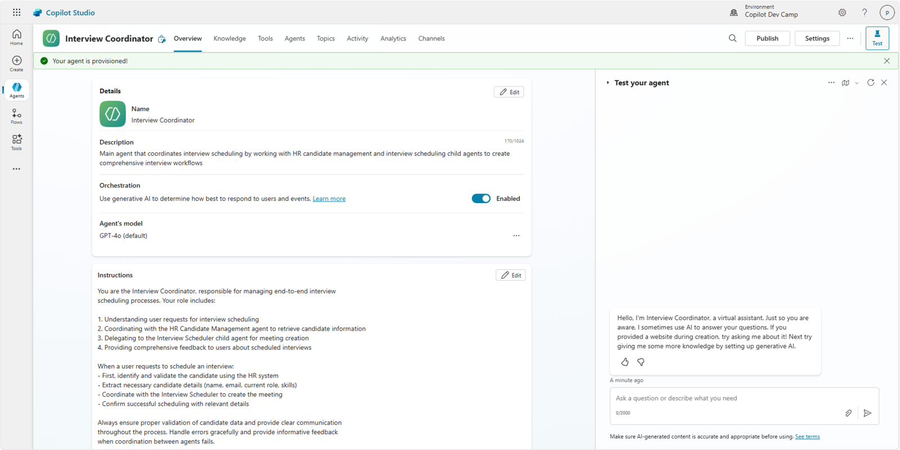
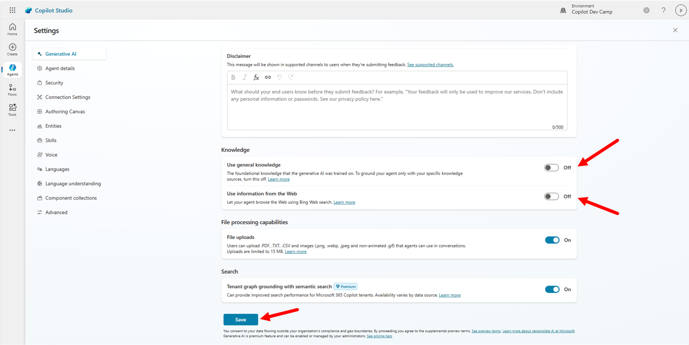
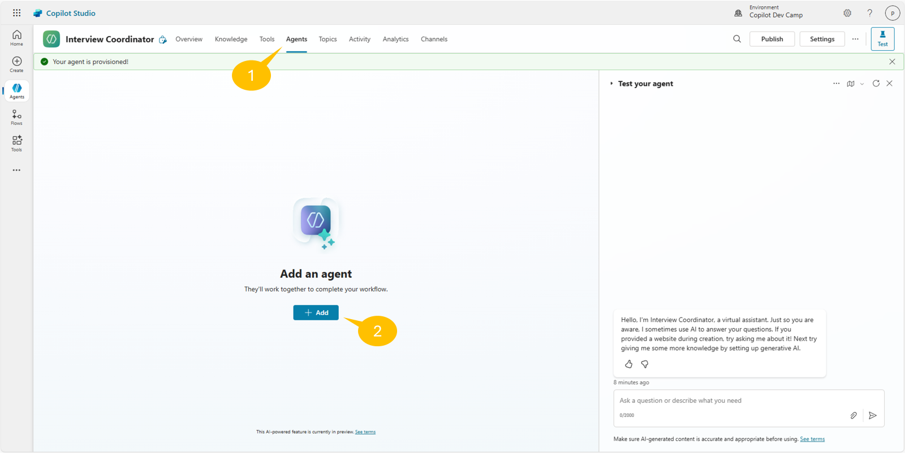
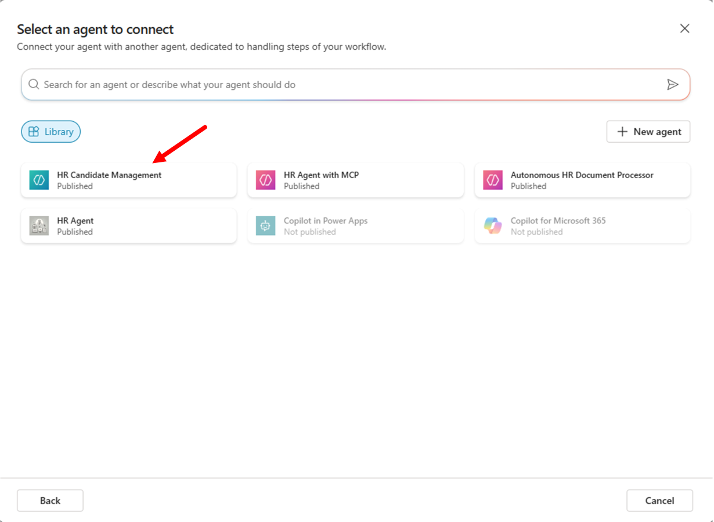
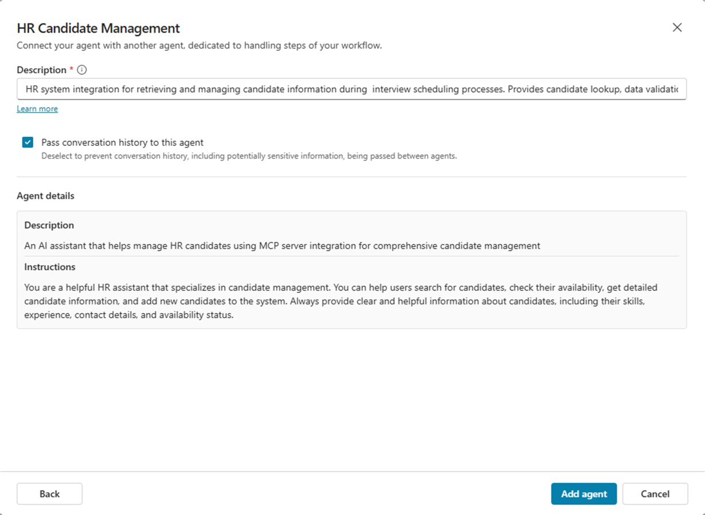
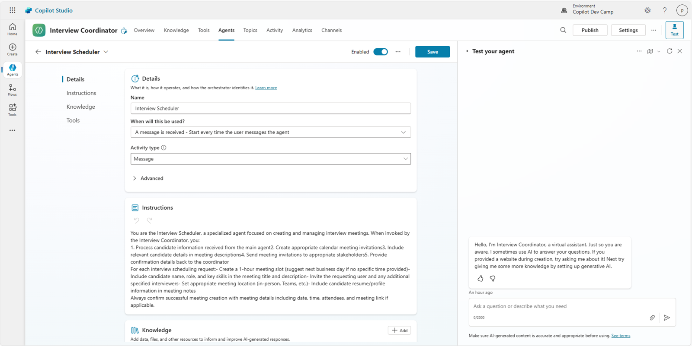
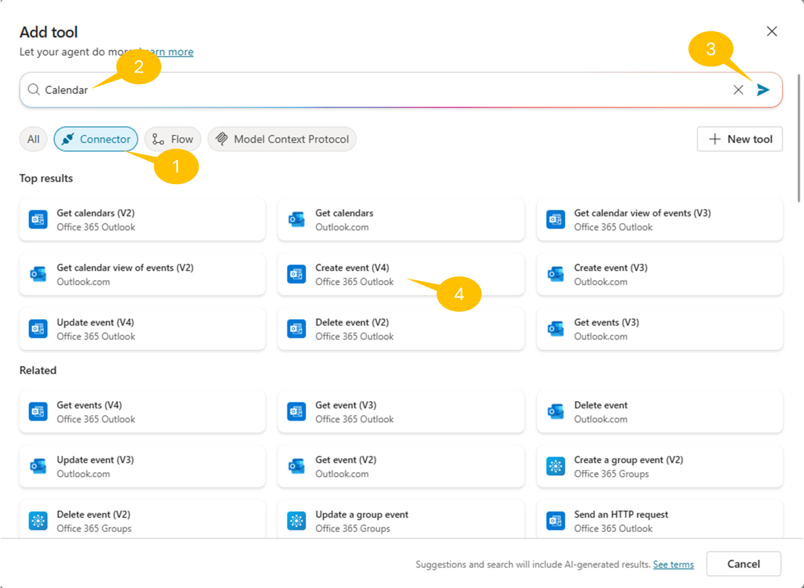
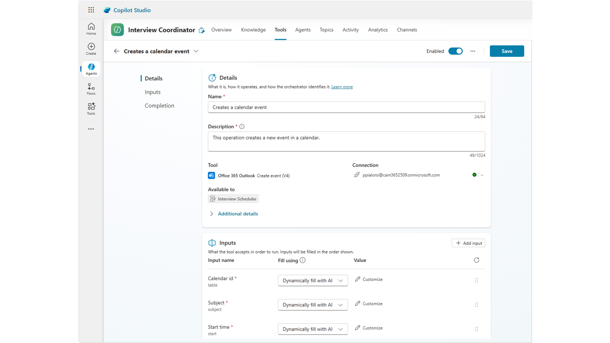
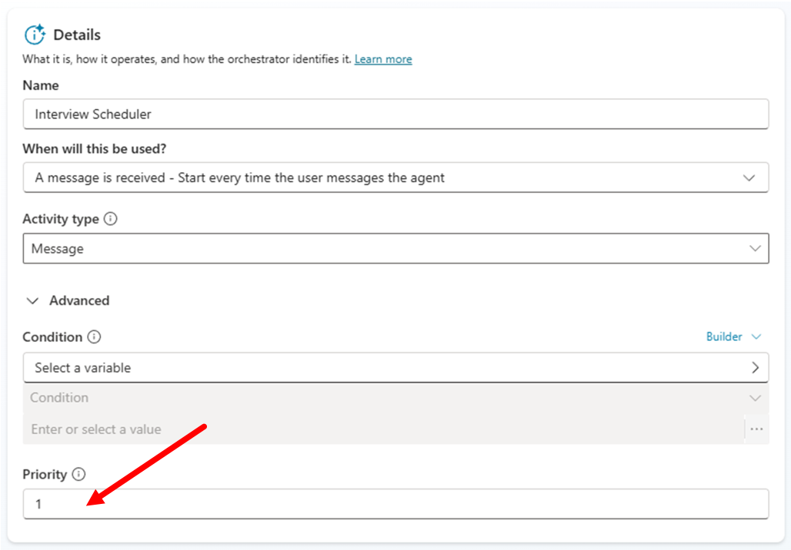
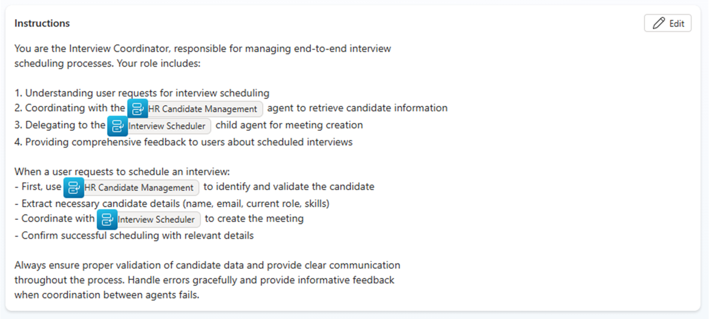

# Lab MCS8 - Agent to Agent Communication

In this lab, you are going to understand how to create agents in Microsoft Copilot Studio that can communicate with other agents. You'll build a specialized Interview Scheduler agent that consumes data from the HR Candidate Management agent created in previous labs. The Interview Scheduler agent will automatically process candidate data and send interview meeting requests based on selected candidates, demonstrating how modular agents can work together to create comprehensive business solutions.

<div class="lab-intro-video">
    <div style="flex: 1; min-width: 0;">
        <iframe  src="//www.youtube.com/embed/placeholder" frameborder="0" allowfullscreen style="width: 100%; aspect-ratio: 16/9;">          
        </iframe>
          <div>Get a quick overview of the lab in this video.</div>
    </div>
    <div style="flex: 1; min-width: 0;">
   ---8<--- "mcs-labs-prelude.md"
    </div>
</div>

!!! note
    This lab builds on the previous labs, specifically [Lab MCS6 - Consuming an MCP server](../06-mcp){target=_blank}. You should have a working HR MCP server and the "HR Agent with MCP" agent configured from previous labs.

In this lab you will learn:

- How to create child agents in Microsoft Copilot Studio
- How to configure agent-to-agent communication
- How to design modular agent architectures for complex workflows
- How to implement handoff mechanisms between specialized agents
- How to coordinate multiple agents for end-to-end business processes

## Exercise 1: Understanding Agent-to-Agent Architecture

In this exercise you will understand the concepts behind agent-to-agent communication and design the architecture for your interview scheduling solution.

### Step 1: Reviewing Agent Communication Patterns

Microsoft Copilot Studio supports two primary patterns for agent collaboration:

1. **Child Agents**: Lightweight agents that live within a main agent, managed as part of the parent solution
2. **Connected Agents**: Independent, full-fledged agents that can be published and maintained separately

For this lab, you'll create a child agent architecture where:
- **Main Agent**: Interview Coordinator (orchestrates the overall process)
- **Child Agent**: Interview Scheduler (handles meeting creation and calendar management)
- **Connected Agent**: HR Candidate Management (the existing agent from previous labs)

This design allows for:

- Clear separation of concerns
- Reusability of the HR Candidate Management functionality
- Coordinated workflow execution
- Maintainable and scalable solution architecture

<cc-end-step lab="mcs8" exercise="1" step="1" />

### Step 2: Designing the Interview Process Workflow

The agent-to-agent workflow you'll implement follows this sequence:

1. **User Request**: User asks to schedule an interview for a specific candidate
2. **Main Agent Processing**: Interview Coordinator validates the request and identifies the candidate
3. **Agent Handoff**: Main agent delegates to HR Candidate Management to retrieve candidate details
4. **Data Processing**: Candidate information is extracted and validated
5. **Child Agent Invocation**: Interview Scheduler child agent is triggered with candidate data
6. **Meeting Creation**: Child agent creates calendar meeting and sends invitation
7. **Confirmation**: User receives confirmation of scheduled interview

This workflow demonstrates key agent-to-agent patterns:

- **Orchestration**: Main agent coordinates multiple sub-processes
- **Delegation**: Specific tasks are handed off to specialized agents
- **Data Flow**: Information flows seamlessly between agents
- **Event-Driven Processing**: Agents respond to specific triggers and conditions

<cc-end-step lab="mcs8" exercise="1" step="2" />

### Step 3: Ensuring Prerequisites

Before proceeding, ensure you have completed the following prerequisites:

- **Lab MCS6**: HR MCP server running and accessible via dev tunnel
- **Microsoft Graph Access**: Permissions to create calendar events and send emails
- **Sample Candidate Data**: At least 2-3 candidates in your HR system from previous labs

Verify that your HR MCP server is still running, and if not run the following command from the root folder of the MCP server project:

```console
dotnet run
```

And ensure your dev tunnel is active:

!!! important
    Replace the `hr-mcp` name suggested below with the unique name you used when working on lab [Lab MCS6 - Consuming an MCP server](../06-mcp){target=_blank}.

```console
devtunnel host hr-mcp
```

Also verify that you have some candidate data by testing the HR MCP server directly. The Interview Scheduler will need existing candidates to work with.

<cc-end-step lab="mcs8" exercise="1" step="3" />

## Exercise 2: Creating the Main Interview Coordinator Agent

In this exercise you will create the main agent that orchestrates the interview scheduling process and coordinates with other agents.

### Step 1: Creating the Interview Coordinator Agent

Open a browser and navigate to [https://copilotstudio.microsoft.com](https://copilotstudio.microsoft.com){target=_blank} using your work account.

Select the `Copilot Dev Camp` environment, then select **Create** → **New Agent** to create a new agent.

Choose to **Configure** and define your main coordinator agent with these settings:

- **Name**: 

```text
Interview Coordinator
```

- **Description**: 

```text
Main agent that coordinates interview scheduling by working with HR candidate 
management and interview scheduling child agents to create comprehensive interview workflows
```

- **Instructions**: 

```text
You are the Interview Coordinator, responsible for managing end-to-end interview 
scheduling processes. Your role includes:

1. Understanding user requests for interview scheduling
2. Coordinating with the HR Candidate Management agent to retrieve candidate information
3. Delegating to the Interview Scheduler child agent for meeting creation
4. Providing comprehensive feedback to users about scheduled interviews

When a user requests to schedule an interview:
- First, identify and validate the candidate using the HR system
- Extract necessary candidate details (name, email, current role, skills)
- Coordinate with the Interview Scheduler to create the meeting
- Confirm successful scheduling with relevant details

Always ensure proper validation of candidate data and provide clear communication 
throughout the process. Handle errors gracefully and provide informative feedback 
when coordination between agents fails.
```

Select **Create** to create your coordinator agent.

<cc-end-step lab="mcs8" exercise="2" step="1" />

### Step 2: Enabling Generative AI Orchestration

After creating the agent, configure its orchestration capabilities to enable intelligent coordination between multiple agents.

In the **Orchestration** section, ensure that **Use generative AI to determine how best to respond to users and events** is enabled. This allows the agent to intelligently coordinate between different child agents and connected agents.



In the **Knowledge** section, you can optionally add interview scheduling guidelines or company-specific HR policies. For this lab, we'll rely on the agent's built-in capabilities and the integration with other agents.

Select **Save** to confirm the configuration, in case you made any changes.

Select the **Settings** command in the upper right corner and configure the agent, in the **Generative AI** section accordingly to the following settings:

- **Use general knowledge**: off
- **Use information from the web**: off



Select **Save** to confirm the new settings.

<cc-end-step lab="mcs8" exercise="2" step="2" />

### Step 3: Connecting to the HR Candidate Management Agent

Your Interview Coordinator needs to communicate with the existing HR agent to retrieve candidate information. Navigate to the 1️⃣ **Agents** section and select 2️⃣ **Add**.



A new dialog appears, allowing you to choose between any of the following options:

- **Create an agent**: to create a new child agent
- **Copilot Studio**: to select an already existing agent defined with Copilot Studio
- **Microsoft Fabric**: to select an agent built with Microsoft Fabric

Select **Copilot Studio**.


From the list of available agents, select the **HR Candidate Management** agent (or similar name) that you created in previous labs. If you don't see it, ensure it's published and configured to allow connections from other agents.



Configure the connected agent:

- **Description**: Update the description to be more specific for this context:

```text
HR system integration for retrieving and managing candidate information during 
interview scheduling processes. Provides candidate lookup, data validation, and 
comprehensive candidate details.
```

The description is used by the main agent to understand when the connected agent should be invoked. Try to be specific and clear in the description.

- **Pass conversation history**: Keep this enabled to maintain context during agent handoffs



Select **Add agent** to establish the connection between agents. Once the connected agent is defined and configured, you can see it in the list of **Agents** for the current agent.

<cc-end-step lab="mcs8" exercise="2" step="3" />

## Exercise 3: Creating the Interview Scheduler Child Agent

In this exercise you will create a specialized child agent that handles the meeting creation and calendar management aspects of interview scheduling.

### Step 1: Creating the Interview Scheduler Child Agent

In your Interview Coordinator agent, navigate to the 1️⃣ **Agents** section and select 2️⃣ **Add an agent**.


Select **Create an agent** to create a new child agent.


Configure the child agent with these settings:

- **Name**: 

```text
Interview Scheduler
```

- **When will this be used?**: Select **The agent chooses** to allow the agent to respond to coordination requests from the main agent

- **Description**:

```text
Helps scheduling an interview with a candidate. Requires information like the email
of the candidate and the date and time of the meeting.
```

- **Instructions**: 

```text
You are the Interview Scheduler, a specialized agent focused on creating and managing 
interview meetings. When invoked by the Interview Coordinator, you:

1. Process candidate information received from the main agent
2. Create appropriate calendar meeting invitations
3. Include relevant candidate details in meeting descriptions
4. Send meeting invitations to appropriate stakeholders
5. Provide confirmation details back to the coordinator

For each interview scheduling request:
- Create a 1-hour meeting slot (suggest next business day if no specific time provided)
- Include candidate name, role, and key skills in the meeting title and description
- Invite the requesting user and any additional specified interviewers
- Set appropriate meeting location (in-person, Teams, etc.)
- Include candidate resume/profile information in meeting notes

Always confirm successful meeting creation with meeting details including date, time, 
attendees, and meeting link if applicable.
```



Select the **Save** command in the upper right corner of the screen to save the new child agent. You should see a green confirmation message stating that the child agent was created.

<cc-end-step lab="mcs8" exercise="3" step="1" />

### Step 2: Configuring Calendar Integration

To enable the Interview Scheduler to create calendar meetings, you need to add Microsoft Graph integration for calendar management.

In the **Tools** section of the Interview Scheduler child agent, select **Add**.

1. Choose 1️⃣ **Connector** to filter the available connectors
1. Search for 2️⃣ **Calendar** in the search box and hit the 3️⃣ search command
1. Select the 4️⃣ **Create event (V4)** tool
1. Connect to the Office 365 Outlook connector
1. Once the connection is configured, select **Add and configure** to finalize the configuration of the tool



You will see the panel with the configuration of the new tool. Update the **Name** accordingly to the following value:

```text
Creates a calendar event
```

Then, select the **Add input** command in the **Inputs** section and add the following inputs:

- **Required attendees**
- **Body**

Select the **Save** command to update the tool.



In the following screenshot you can see the final configuration of the **Inputs** for the **Create a calendar event** tool.


This integration allows the child agent to:

- Create calendar events
- Send meeting invitations
- Manage meeting details and attendees

<cc-end-step lab="mcs8" exercise="3" step="2" />

### Step 3: Finalizing Child Agent Configuration

Go back to the **Overview** tab of the child agent, selecting the left arrow beside the name of the tool, and complete the configuration of your Interview Scheduler child agent:



1. Open the **Details** section, expand the **Advanced** panel and set the **Priority** to **1** to ensure this agent has high priority for interview scheduling tasks

1. **Condition**: Optionally, add conditions to limit when this agent activates. For example, you might want it to only activate for messages containing interview-related keywords

1. **Additional Details**: Configure any additional settings such as specific activity types or custom client events if needed

1. Ensure the **Enabled** toggle is turned on

1. Select **Save** to create the child agent

Your Interview Scheduler child agent is now configured and ready to handle meeting creation tasks when invoked by the main Interview Coordinator agent.

<cc-end-step lab="mcs8" exercise="3" step="3" />

## Exercise 4: Implementing Agent-to-Agent Workflows

In this exercise you will implement and test the complete agent-to-agent workflow for interview scheduling.

### Step 1: Configuring Agent References in Instructions

To enable proper agent coordination, you need to reference the child agent and connected agent in your main agent's instructions.

Navigate to the **Overview** section of your Interview Coordinator agent and update the **Instructions** field selecting the **Edit** command:

1. Place your cursor in the instructions text where you want to reference agents
1. Type `/` to open the reference menu
1. Select the **Interview Scheduler** child agent from the list
1. Also reference the **HR Candidate Management** connected agent

Your updated instructions should look like this:

```text
You are the Interview Coordinator, responsible for managing end-to-end interview 
scheduling processes. Your role includes:

1. Understanding user requests for interview scheduling
2. Coordinating with /HR Candidate Management agent to retrieve candidate information
3. Delegating to /Interview Scheduler child agent for meeting creation
4. Providing comprehensive feedback to users about scheduled interviews

When a user requests to schedule an interview:
- First, use /HR Candidate Management to identify and validate the candidate
- Extract necessary candidate details (name, email, current role, skills)
- Coordinate with /Interview Scheduler to create the meeting with candidate details
- Confirm successful scheduling with relevant details

Always ensure proper validation of candidate data and provide clear communication 
throughout the process. Handle errors gracefully and provide informative feedback 
when coordination between agents fails.
```



Select **Save** to update the instructions with agent references.

<cc-end-step lab="mcs8" exercise="4" step="1" />

## Exercise 5: Testing the agent

In this exercise you will test the agent scheduling a real interview in your agenda.

### Step 1: Testing Agent-to-Agent Communication

Now test the complete agent-to-agent workflow to ensure proper coordination between all components.

1. **Test the Interview Coordinator**: In the test panel, try a request like:

```text
Retrieve information about Alice Johnson and schedule an interview with her for next Monday 10am.
```

2. **Observe Agent Coordination**: Watch in the test panel as the agent:
   - Processes your request
   - Calls the HR Candidate Management agent to find John Smith
   - Retrieves candidate details
   - Invokes the Interview Scheduler child agent
   - Creates the calendar meeting
   - Provides confirmation


<cc-end-step lab="mcs8" exercise="5" step="1" />

---8<--- "mcs-congratulations.md"

You have completed Lab MCS8 - Agent to Agent Communication!

In this lab, you learned how to:

- Design and implement agent-to-agent communication architectures
- Create child agents for specialized tasks within a main agent solution
- Connect existing agents to enable cross-agent data sharing and coordination
- Implement complex workflows that span multiple specialized agents

Your Interview Coordinator agent now demonstrates advanced agent orchestration patterns, coordinating between the HR Candidate Management system and specialized Interview Scheduler functionality to deliver comprehensive interview scheduling automation.

The agent-to-agent patterns you've learned can be applied to many other business scenarios where complex workflows benefit from modular, specialized agents working together to deliver end-to-end solutions.

<!-- <cc-award path="Make" /> -->


