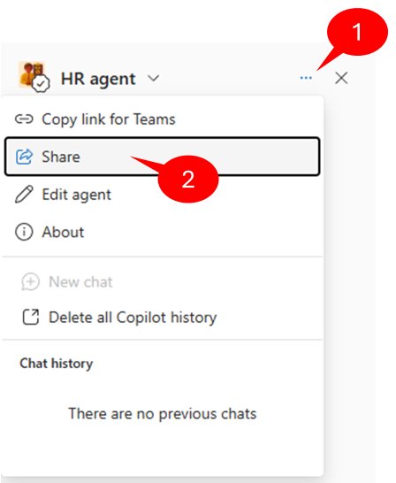
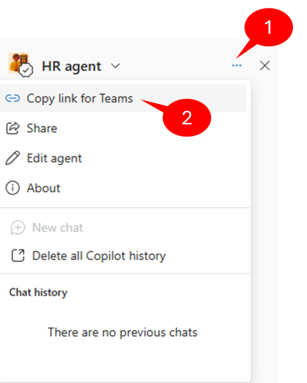
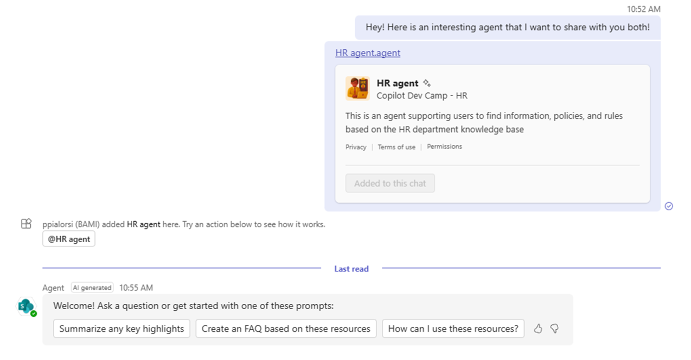
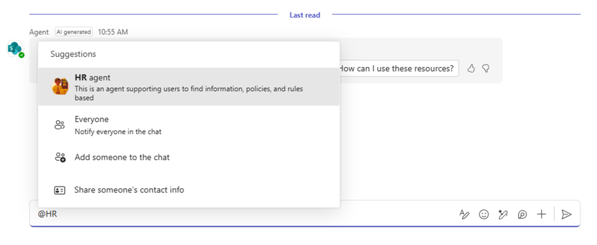

# Lab MSA2 - Sharing SharePoint agents

---8<--- "msa-labs-prelude.md"

In this lab, you'll see how to share your SharePoint agents with others either using a direct link or within Microsoft Teams chats.

## Exercise 1: Sharing a SharePoint agent

Since every SharePoint agent is a file, you can easily share it with other people.

### Step 1: Sharing a SharePoint agent with people

When you have a SharePoint agent, whether it is local to a document library or approved and promoted at site level, you can select the **...** 1️⃣ beside the agent name and then select the option to **Share** 2️⃣ the agent.

The modern file sharing User Experience of SharePoint Online will show up and you will be able to share the .agent file with others in your organization. As like as it happens with any other SharePoint Online file, you can choose the target people (user, groups, or emails) to share the agent with and you can either get a link to the file or send a sharing notification email. If you choose to copy a link, you can then paste it wherever you like.

The sharing link will bring target users straight to the agent dialog, so that they will able to interact with the agent directly within the immersive and full scren SharePoint agent experience.

<cc-end-step lab="msa2" exercise="1" step="1" />

### Step 2: Sharing a SharePoint agent via Microsoft Teams

An interesting option that you have is to share the agent via Microsoft Teams. In order to do that, you simply need to select the **...** 1️⃣ beside the agent name and then select the option to **Copy link for Teams** 2️⃣.

This will generate a sharing link for the agent file and copy it into the clipboard, as you can see from the confirmation message that you get back. In the confirmation message, you can also notice that the generated link is ready to be pasted in any group chat in Microsoft Teams.

In the dialog you can also select the **Settings** link to configure who can access the sharing link and to setup an optional expiration date for the link. Under the cover, a regular sharing link of SharePoint Online will be created.
Let's paste the link into a group chat in order to see what happens.

When you paste the link into a group chat, you will see a nice looking adaptive card providing information about the agent. This happens due to a custom link unfurling extension for Teams that handles the .agent files. Send the chat message with the link. The adaptive card will slightly change its rendering and will provide you a command to **Add to this chat** the agent.

Select the command, and wait few seconds. In case of successful result you will see a message confirming that the agent was added to the chat and you will also promptly see a welcome message from the agent itself. In case of any issue, the command button to **Add to this chat** will become disabled and the text will change to **Error adding to chat**. You can always try to refresh the chat and try again adding the agent.

<cc-end-step lab="msa2" exercise="1" step="2" />

### Step 3: Interacting with the shared agent in Microsoft Teams

You can now interact with the agent within the group chat experience in Microsoft Teams. Whenever you want to trigger the agent, you simply need to at mention by name (@HR Agent) the agent and send it a prompt to process.

The SharePoint agent will process the prompt and provide an answer. However, for security reasons the answer will not go straight to the chat. You will need to evaluate its content and the documents referenced by the agent to produce the response. Select the **View response** command to evaluate the answer. 

When you select **View response** a popup dialog shows up, allowing you to evaluate the whole response text and the referenced attachments, if any, prior to share the result with others. If you are ok with the answer, you can confirm and send the actual response message to the chat.

Select the **Send** command to confirm that the response and its attachments are ok for you. You can also instruct Microsoft Teams to trust any further responses from the agent for the next 24 hours, to avoid too many confirmation requests. Select the **Don't send** command if you are not happy with the response or if you don't want to disclose one or more of the documents referenced by the agent in the response. Users in the group chat will see a message from the agent stating that "[YOUR USER DISPLAY NAME] reviewed my response to the request made and suggested that I don't share it at this time.".

You can now enjoy the integration between Microsoft Teams and the SharePoint agent.

<cc-end-step lab="msa2" exercise="1" step="3" />

---8<--- "msa-congratulations.md"

You have completed Lab MSA2 - Sharing SharePoint agents!

